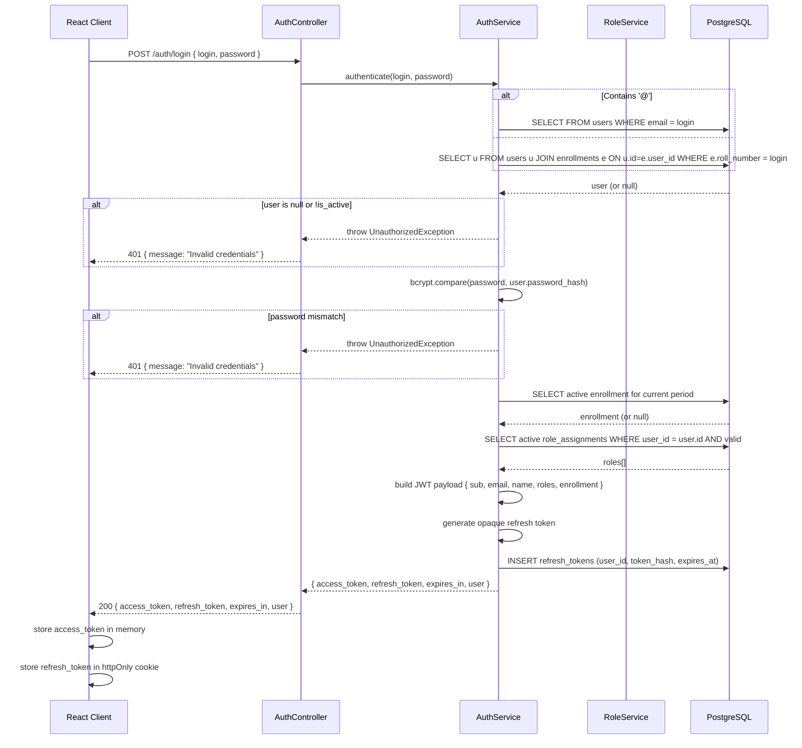
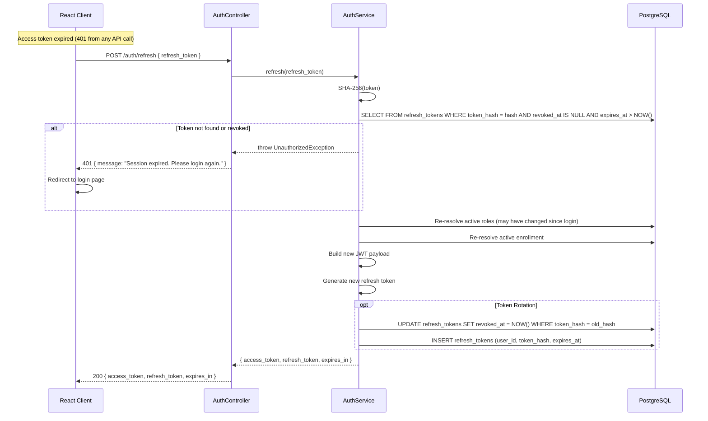
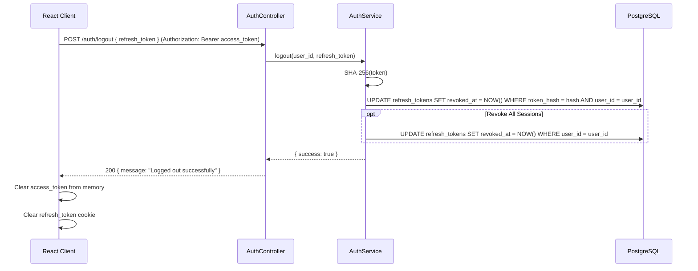
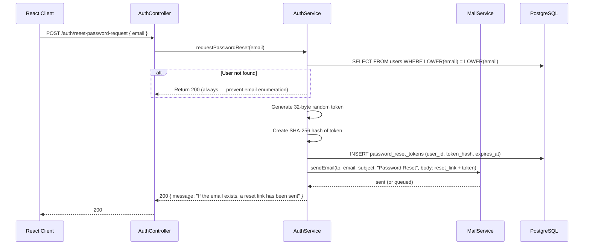
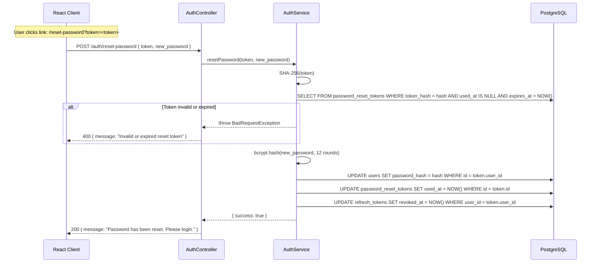
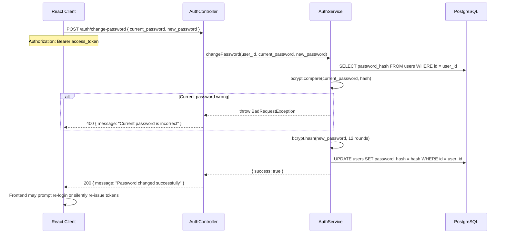
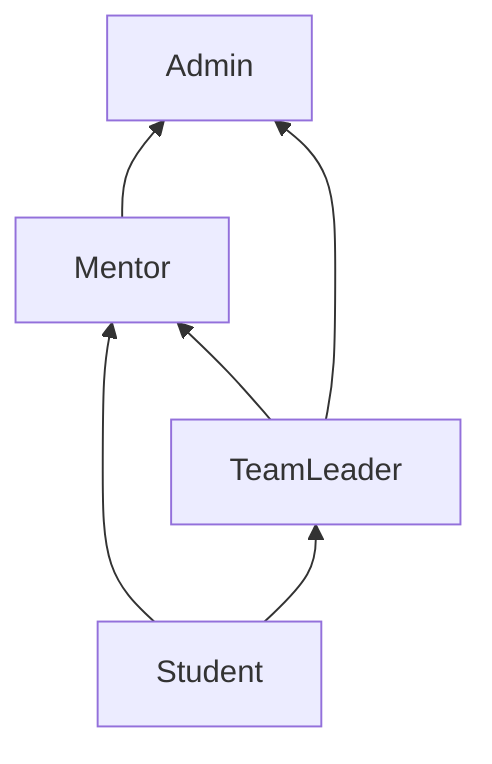

# Authentication & Authorization Design

> **Version:** 1.0  
> **Approved Architecture:** `ARCHITECTURE.md` §3 (Identity Model), §4 (Authorization Model)  
> **Approved Schema:** `SCHEMA.md` §4.1 (users, role_assignments, enrollments)  
> **Target:** NestJS, PostgreSQL, React, JWT

---

## 1. Authentication Architecture

### 1.1 Trust Boundary

```
┌─────────────────────────────────────────────────────────────────────┐
│  Browser (React SPA)                     │  Server (NestJS)        │
│                                          │                         │
│  ┌────────────┐     HTTPS (no HTTP)      │  ┌───────────────────┐  │
│  │  Login     │──────────────────────────→│  │  AuthController   │  │
│  │  Page      │←── JWT (access + refresh)│  │  AuthService      │  │
│  └────────────┘                           │  │  BcryptService    │  │
│                                          │  └─────────┬─────────┘  │
│  ┌────────────┐     JWT in               │            │            │
│  │  App Shell │─── Authorization: Bearer──│  ┌─────────▼─────────┐  │
│  │  (React)   │     (access token)        │  │  JwtStrategy     │  │
│  └────────────┘                           │  │  (passport.js)   │  │
│                                          │  └─────────┬─────────┘  │
│  ┌──────────────────────┐                │            │            │
│  │  httpOnly cookie OR  │                │  ┌─────────▼─────────┐  │
│  │  localStorage        │                │  │  AuthGuard        │  │
│  │  (refresh token)     │                │  │  (global guard)   │  │
│  └──────────────────────┘                │  └───────────────────┘  │
└─────────────────────────────────────────────────────────────────────┘
```

### 1.2 Token Strategy

| Token | Format | Lifetime | Storage (Client) | Revocable |
|---|---|---|---|---|
| Access Token | JWT (signed RS256 or HS256) | 15 minutes | `Authorization: Bearer` header (in-memory variable only) | No — short TTL mitigates |
| Refresh Token | Opaque 256-bit random string, stored as SHA-256 hash in DB | 7 days | httpOnly secure cookie (preferred) OR localStorage | Yes — delete from `refresh_tokens` table |

**Why opaque refresh tokens instead of JWT refresh tokens:**
- Opaque tokens are revocable by DB deletion (cannot be verified without DB lookup)
- JWT refresh tokens, once issued, are valid until expiry unless a blocklist is maintained
- A blocklist negates the stateless advantage of JWTs
- At 5,000 users, the DB lookup for refresh token validation is negligible (<5ms)

### 1.3 JWT Access Token Payload

```json
{
  "sub": "uuid-of-user",
  "email": "user@college.edu",
  "name": "Full Name",
  "roles": [
    { "role": "mentor", "scope_type": "section", "scope_id": "uuid" },
    { "role": "team_leader", "scope_type": "group", "scope_id": "uuid" }
  ],
  "enrollment": {
    "id": "uuid",
    "academic_period_id": "uuid",
    "branch_id": "uuid",
    "section_id": "uuid",
    "group_id": "uuid-or-null",
    "batch_id": "uuid"
  },
  "iat": 1700000000,
  "exp": 1700000900
}
```

**Design decisions:**
- `roles` array contains only **currently valid** RoleAssignments (WHERE valid_from <= NOW() AND (valid_to IS NULL OR valid_to > NOW())). Resolved at login time.
- `enrollment` contains user's **active** enrollment for the **current** academic period. Resolved at login time. Null if user is not a student.
- Token is ~400–600 bytes. Well within the 8KB header size limit for all common reverse proxies.
- Trade-off: role changes require re-login or refresh token rotation. Refresh token grant re-resolves roles from DB.

---

## 2. Login Flow

### 2.1 Credential Resolution

```
Login form input: "email or roll number + password"
                        │
                        ▼
         ┌────────────────────────────┐
         │  Contains '@'?             │
         │  YES → email login          │
         │  NO  → roll number login    │
         └────────────┬───────────────┘
                      │
         ┌────────────▼───────────────┐
         │  email login:               │
         │  SELECT * FROM users        │
         │  WHERE LOWER(email) = LOWER(input)  │
         │              AND is_active = TRUE    │
         └────────────┬───────────────┘
                      │
         ┌────────────▼───────────────┐
         │  roll number login:         │
         │  SELECT u.* FROM users u    │
         │  JOIN enrollments e         │
         │  ON u.id = e.user_id        │
         │  WHERE e.roll_number = input│
         │  AND e.is_active = TRUE     │
         │  AND u.is_active = TRUE     │
         │  LIMIT 1                     │
         └────────────┬───────────────┘
                      │
         ┌────────────▼───────────────┐
         │  bcrypt.verify(password,    │
         │           user.password_hash)│
         │  FAIL → 401 Unauthorized    │
         │  PASS → continue            │
         └────────────┬───────────────┘
                      │
         ┌────────────▼───────────────┐
         │  Resolve current enrollment │
         │  and active roles           │
         │  Build JWT payload          │
         │  Generate access + refresh  │
         │  Store refresh token hash   │
         └────────────┬───────────────┘
                      │
         ┌────────────▼───────────────┐
         │  Return:                   │
         │  • access_token (JWT)       │
         │  • refresh_token (opaque)   │
         │  • expires_in (seconds)     │
         │  • user (id, name, email,   │
         │    roles, enrollment)       │
         └────────────────────────────┘
```

### 2.2 Sequence Diagram



---

## 3. Refresh Token Flow



**Token Rotation (recommended):** Each refresh token use invalidates the old token and issues a new one. If a stolen refresh token is used after the legitimate user has already rotated it, the old token's hash will not be found in the DB, indicating token theft. The system can then revoke all refresh tokens for that user.

---

## 4. Logout Flow



**Design decisions:**
- Logout requires the refresh token (to revoke the specific session)
- Optionally supports "logout all devices" which revokes every refresh token for the user
- Access token remains valid until natural expiry (15 min) — acceptable risk
- Frontend immediately discards access token from memory

---

## 5. Password Reset Flow

### 5.1 Request Reset



### 5.2 Complete Reset



**Security decisions:**
- Token is 32 bytes (256 bits) of cryptographically random data
- Only the SHA-256 hash is stored in the database — the raw token is never persisted
- Token expires in 1 hour
- All existing sessions are revoked on password reset
- Rate limit: 1 request per 5 minutes per email

### 5.3 Change Password (Authenticated)



---

## 6. Session Strategy

### 6.1 Session Model

This system uses a **stateless session model** with revocable refresh tokens.

| Property | Access Token | Refresh Token |
|---|---|---|
| Stateful? | No (JWT is self-validating) | Yes (DB lookup required) |
| Contains | User identity + roles + enrollment | Nothing (random opaque string) |
| Server storage | None | SHA-256 hash in `refresh_tokens` table |
| Client storage | In-memory variable (React state) | httpOnly secure cookie (SameSite=Strict) |

**Why store access tokens in memory instead of localStorage or cookies:**
- In-memory tokens are invulnerable to XSS-based token theft (no script can read a JavaScript variable scoped to a closure)
- Trade-off: tokens are lost on page refresh, requiring a refresh token grant
- The refresh token grant is a single async call at app boot — negligible UX impact
- This is the security model used by Auth0, Okta, and Keycloak SPAs

### 6.2 Session Table

```sql
-- Required addition to schema: refresh token storage
CREATE TABLE refresh_tokens (
    id          UUID PRIMARY KEY DEFAULT gen_random_uuid(),
    user_id     UUID NOT NULL REFERENCES users(id) ON DELETE CASCADE,
    token_hash  VARCHAR(64) NOT NULL,       -- SHA-256 hex
    family      VARCHAR(32) NOT NULL,       -- token family for rotation detection
    expires_at  TIMESTAMPTZ NOT NULL,
    revoked_at  TIMESTAMPTZ,
    created_at  TIMESTAMPTZ NOT NULL DEFAULT NOW()
);

CREATE INDEX idx_refresh_tokens_hash ON refresh_tokens (token_hash);
CREATE INDEX idx_refresh_tokens_user ON refresh_tokens (user_id);
CREATE INDEX idx_refresh_tokens_expires ON refresh_tokens (expires_at)
    WHERE revoked_at IS NULL;

CREATE TABLE password_reset_tokens (
    id          UUID PRIMARY KEY DEFAULT gen_random_uuid(),
    user_id     UUID NOT NULL REFERENCES users(id) ON DELETE CASCADE,
    token_hash  VARCHAR(64) NOT NULL,
    expires_at  TIMESTAMPTZ NOT NULL,
    used_at     TIMESTAMPTZ,
    created_at  TIMESTAMPTZ NOT NULL DEFAULT NOW()
);

CREATE INDEX idx_password_reset_tokens_hash ON password_reset_tokens (token_hash);
```

### 6.3 Concurrent Session Limit

At 5,000 users, the system should not enforce a hard concurrent session limit. Each refresh token represents one active session. A user may have:
- 1 session (desktop browser)
- 2–3 sessions (desktop + mobile + incognito)

No hard limit until abuse is detected. An admin can revoke all sessions from the user management panel.

### 6.4 Session Cleanup

A scheduled job (NestJS `@Cron`) runs daily:

```sql
DELETE FROM refresh_tokens WHERE expires_at < NOW() - INTERVAL '30 days';
DELETE FROM password_reset_tokens WHERE expires_at < NOW() - INTERVAL '7 days';
```

---

## 7. Role Resolution Strategy

### 7.1 Resolution Order

```
User at login time
        │
        ▼
┌─────────────────────────────┐
│  Resolve "Student" status   │
│  (Implicit, based on        │
│   active enrollment)        │
└──────────┬──────────────────┘
           │
           ▼
┌─────────────────────────────┐
│  Resolve explicit roles     │
│  (SELECT FROM               │
│   role_assignments          │
│   WHERE user_id = ?         │
│   AND valid_from <= NOW()   │
│   AND (valid_to IS NULL     │
│     OR valid_to > NOW()))   │
└──────────┬──────────────────┘
           │
           ▼
┌─────────────────────────────┐
│  Combine into role set      │
│  • admin (global scope)     │
│  • mentor (section scope)   │
│  • team_leader (group scope)│
│  • student (implied by      │
│     enrollment)             │
└──────────┬──────────────────┘
           │
           ▼
┌─────────────────────────────┐
│  Encode into JWT payload    │
│  as "roles" array           │
└─────────────────────────────┘
```

### 7.2 Role Hierarchy (for inheritance)



**Inheritance rules:**
- Admin inherits Mentor permissions (can verify submissions, view section analytics)
- Admin inherits TL permissions
- Mentor inherits TL permissions for their section (mentor can verify any group in their section)
- TL inherits Student permissions (can submit, view own participation)
- Inheritance is resolved at the PDP level, not in the JWT

**Implementation:** The Policy Decision Point (PDP) evaluates `effective_roles(user)` which expands:

```
if user.has_role('admin') → [admin, mentor, team_leader, student]
if user.has_role('mentor') → [mentor, team_leader, student]
if user.has_role('team_leader') → [team_leader, student]
if user.has_enrollment() → [student]
```

### 7.3 Role Resolution on Token Refresh

The refresh token grant re-resolves roles from the database. This means:
- A user promoted to Mentor during their session will see the new role after their next refresh (within 15 minutes)
- A user whose role was revoked will lose access within 15 minutes
- This is the correct trade-off: instant revocation via refresh + 15-min access token window

---

## 8. Permission Matrix

### 8.1 Entity-Level Permissions

| Action | Admin | Mentor | TL | Student | Conditions |
|---|---|---|---|---|---|
| CRUD Opportunity | ✓ | — | — | — | Admin only |
| Publish/Close Opportunity | ✓ | — | — | — | State machine |
| Assign Mentor to Section | ✓ | — | — | — | |
| Assign TL to Group | ✓ | — | — | — | |
| Assign Student to Group | ✓ | ✓ | — | — | Within own section |
| View Section Dashboard | ✓ | ✓ | — | — | Own section for Mentor |
| View Group Dashboard | ✓ | ✓ | ✓ | ✓ | Own group for TL; own data for Student |
| View All Submissions (Section) | ✓ | ✓ | — | — | Own section |
| View Submissions (Group) | ✓ | ✓ | ✓ | — | Own group for TL |
| Verify Submission | —* | ✓** | ✓ | — | Own group for TL; override for Mentor |
| Reject Submission | —* | ✓** | ✓ | — | Own group for TL; override for Mentor |
| Submit Participation | — | — | — | ✓ | Opportunity must be Open |
| View Own Participation | ✓ | ✓ | ✓ | ✓ | Always |
| Upload Proof | — | — | — | ✓ | Own submission |
| View Analytics (College-wide) | ✓ | — | — | — | |
| View Analytics (Section) | ✓ | ✓ | — | — | |
| View Analytics (Group) | ✓ | ✓ | ✓ | ✓ | |
| Manage Academic Structure | ✓ | — | — | — | |
| Bulk Import Students | ✓ | — | — | — | |
| Manage Users | ✓ | — | — | — | |
| Escalate Verification | ✓ | ✓ | ✓ | ✓ | After threshold |

*\* Admin can verify only in escalation path (when both TL and Mentor are inactive).  
** Mentor can override TL verification or step into any group in their section after escalation threshold.*

### 8.2 Scope Resolution

```
Request: "Verify submission {submissionId}"
                        │
                        ▼
┌───────────────────────────────────────────┐
│  PDP.authorize(user, 'verify', submission) │
└───────────────────┬───────────────────────┘
                    │
         ┌──────────▼──────────┐
         │  Does user have     │
         │  role 'admin'?      │ YES → Allow (see note)
         │                     │
         │  Does user have     │
         │  role 'mentor' AND  │
         │  submission.section │
         │  IN user.sections?  │ YES → Allow
         │                     │
         │  Does user have     │
         │  role 'team_leader' │
         │  AND submission     │
         │  .group IN user     │
         │  .groups?           │ YES → Allow
         │                     │
         │  Otherwise          │ → Deny 403
         └─────────────────────┘
```

### 8.3 Implicit Student Role

Business Rule #1: "Every user is a student by default."

**Implementation:** The implicit "student" role is resolved at the PDP level, not stored in `role_assignments`.

```
is_student(user) := EXISTS (
    SELECT 1 FROM enrollments 
    WHERE user_id = user.id 
      AND is_active = TRUE
)
```

A user with an active enrollment is a student. A user without enrollment is not a student (e.g., admin-only accounts, external mentors). This avoids creating a `role_assignments` row for every student (saving 1,000–5,000 rows).

---

## 9. Route Protection Strategy

### 9.1 NestJS Guard Architecture

```
Request → AuthGuard → RolesGuard → ScopeGuard → Controller
           │              │            │
           ▼              ▼            ▼
     Validates JWT   Checks role    Checks scope
     Sets req.user   membership     (ABAC attributes)
```

### 9.2 Guard Definitions

**AuthGuard** (Global, applied to all routes except login/register/reset):

| Responsibility | Implementation |
|---|---|
| Extract JWT from `Authorization: Bearer <token>` header | passport-jwt strategy |
| Verify JWT signature | JwtService.verify() with secret/public key |
| Check expiry | Automatic (JWT library rejects expired tokens) |
| Check user.is_active | DB lookup on deserialization |
| Attach user to request | `req.user = { id, email, roles, enrollment }` |

**RolesGuard** (Applied at controller level):

```
@UseGuards(RolesGuard)
@Roles('mentor', 'admin')    // <-- custom decorator
@Get('sections/:id/dashboard')
```

| Role | Decorator | Resolves To |
|---|---|---|
| `admin` | `@Roles('admin')` | `user.roles[].role === 'admin'` |
| `mentor` | `@Roles('mentor')` | `user.roles[].role === 'mentor'` |
| `team_leader` | `@Roles('team_leader')` | `user.roles[].role === 'team_leader'` |
| `student` | `@Roles('student')` | `user.enrollment !== null` |

**ScopeGuard** (ABAC — checks resource-level conditions):

```
@UseGuards(ScopeGuard)
@Scope('section', { param: 'sectionId', role: 'mentor' })
@Patch('sections/:sectionId/reassign-student')
```

The ScopeGuard extracts `sectionId` from the request params, then verifies:
- For mentor: `user.roles[].role === 'mentor' AND user.roles[].scope_id === sectionId`
- For TL: `user.roles[].role === 'team_leader' AND user.roles[].scope_id === groupId` (where group is resolved from context)

**Scope Resolution by Resource:**

| Resource | Scope Parameter | Role | Resolution |
|---|---|---|---|
| Section | `sectionId` (path) | Mentor | `scope_id == sectionId` |
| Group | `groupId` (path) | TL | `scope_id == groupId` |
| Opportunity | `opportunityId` (path) → academic_period_id | Admin | No scope check |
| Participation | `participationId` (path) → enrollment.user_id | Student | `user_id == req.user.id` |
| Submission | `submissionId` (path) → participation → group | TL | `scope_id == groupId` |
| Own profile | implicit | Student | `user_id == req.user.id` |

### 9.3 NestJS Module Structure

```
src/
  modules/
    auth/
      AuthModule          -- @Module({ imports: [JwtModule, UserModule, MailModule] })
      AuthService         -- authenticate(), refresh(), logout(), requestPasswordReset(), resetPassword()
      strategies/
        JwtStrategy       -- passport-jwt strategy (extracts/validates token)
        LocalStrategy     -- passport-local strategy (email/password) -- optional wrapping
      guards/
        JwtAuthGuard      -- extends AuthGuard('jwt')
    
    iam/                  -- Identity & Access Management
      IamModule           -- @Module({ imports: [RoleModule, EnrollmentModule] })
      RoleService         -- resolveRoles(userId), assignRole(), revokeRole()
      EnrollmentService   -- getActiveEnrollment(userId)
      guards/
        RolesGuard        -- checks @Roles() decorator
        ScopeGuard        -- checks @Scope() decorator (ABAC)
        OwnershipGuard    -- checks resource belongs to user
      decorators/
        Roles.decorator   -- @Roles('admin', 'mentor')
        Scope.decorator   -- @Scope('section', ...)
        CurrentUser.decorator -- @CurrentUser() parameter decorator
    
    user/
      UserModule          -- CRUD for users
      UserService         -- findById(), findByEmail(), create(), updatePassword()
```

### 9.4 Route Protection Mapping

| Route Pattern | Auth | Role | Scope | Ownership |
|---|---|---|---|---|
| `POST /auth/login` | Public | — | — | — |
| `POST /auth/refresh` | Public | — | — | — |
| `POST /auth/reset-password-request` | Public | — | — | — |
| `POST /auth/reset-password` | Public | — | — | — |
| `POST /auth/logout` | JWT | Any | — | — |
| `POST /auth/change-password` | JWT | Any | — | Own user |
| `GET /opportunities` | JWT | Student+ | — | — |
| `POST /opportunities` | JWT | Admin | — | — |
| `PATCH /opportunities/:id/state` | JWT | Admin | — | — |
| `GET /sections/:id/dashboard` | JWT | Mentor+ | Section | — |
| `GET /groups/:id/submissions` | JWT | TL+ | Group | — |
| `POST /submissions` | JWT | Student | — | — |
| `PATCH /submissions/:id/verify` | JWT | TL+ | Group | — |
| `GET /enrollments/me` | JWT | Student | — | Own |
| `POST /admin/roles` | JWT | Admin | — | — |

---

## 10. Security Best Practices

### 10.1 Password Policy

| Requirement | Value |
|---|---|
| Minimum length | 10 characters |
| Hashing algorithm | bcrypt |
| bcrypt cost factor | 12 rounds (~250ms per hash on modern hardware) |
| Maximum login attempts | 5 per 15 minutes per IP |
| Account lockout | 15 minutes after max attempts |
| Password history | Not enforced (MVP; add in Phase 2) |
| Rate limiting | `@nestjs/throttler` — global 100 req/min, auth routes 10 req/min |

### 10.2 JWT Configuration

| Parameter | Value |
|---|---|
| Signing algorithm | RS256 (asymmetric) or HS256 (symmetric) |
| Key rotation | RS256: rotate signing key every 90 days; keep previous public key for token validation during grace period |
| Issuer | `placement-tracker` |
| Audience | `placement-tracker-api` |
| Clock skew tolerance | 30 seconds |
| `sub` claim | User UUID |

**Recommendation:** Start with HS256 for simplicity (single secret). Migrate to RS256 when multiple services need to validate tokens without sharing a secret.

### 10.3 Refresh Token Configuration

| Parameter | Value |
|---|---|
| Token entropy | 256 bits (32 bytes from `crypto.randomBytes()`) |
| Storage | SHA-256 hash in `refresh_tokens` table |
| Max active tokens per user | No limit (anti-DoS: cap at 50) |
| Rotation | Issue new token on each refresh grant; revoke old |
| Family detection | If a revoked token is presented, revoke all tokens in the same family (indicates token theft) |

### 10.4 CSRF Protection

Since the SPA stores the access token in memory and the refresh token in an httpOnly cookie:
- CSRF attacks cannot read the access token (it's in memory, not in a cookie)
- CSRF attacks cannot use the refresh token (it's protected by SameSite=Strict)

**Additional protection:** The refresh token endpoint requires a custom header (e.g., `X-Refresh-Token: 1`) that cannot be set by cross-origin requests without CORS preflight.

### 10.5 XSS Protection

| Layer | Protection |
|---|---|
| React | Default escaping in JSX; no `dangerouslySetInnerHTML` without review |
| Access tokens | Never stored in localStorage — only in memory (React state/closure) |
| Refresh tokens | httpOnly + Secure + SameSite=Strict cookie (inaccessible to JavaScript) |
| User input | Validation + sanitization at API boundary |
| CSP | Content-Security-Policy header restricting script sources |

### 10.6 Additional Measures

| Measure | Implementation |
|---|---|
| CORS | Whitelist only the SPA origin (e.g., `https://placement.college.edu`) |
| Helmet | Use `helmet` middleware for security headers |
| Rate limiting | `@nestjs/throttler` with storage in Redis (or in-memory for MVP) |
| Audit logging | Log all auth events (login success, login failure, token refresh, password change) to application logs |
| Token theft detection | Monitor for refresh token family conflicts; alert on detection |
| Secure headers | `Strict-Transport-Security`, `X-Content-Type-Options`, `X-Frame-Options` |
| Input validation | Use `class-validator` DTOs for all auth endpoints |

### 10.7 Audit Events

| Event | Logged Data | Use Case |
|---|---|---|
| LOGIN_SUCCESS | user_id, email, ip, user_agent, timestamp | Normal activity tracking |
| LOGIN_FAILURE | login_attempt, ip, user_agent, timestamp | Brute force detection |
| LOGOUT | user_id, timestamp | Session tracking |
| TOKEN_REFRESH | user_id, timestamp | Detect refresh token abuse |
| PASSWORD_RESET_REQUEST | user_id (if found), ip, timestamp | Abuse monitoring |
| PASSWORD_RESET_COMPLETE | user_id, timestamp | Security audit |
| PASSWORD_CHANGE | user_id, timestamp | Security audit |
| ROLE_ASSIGNED | actor_user_id, target_user_id, role, scope | Compliance audit |
| ROLE_REVOKED | actor_user_id, target_user_id, role, scope | Compliance audit |

---

## 11. Summary of Database Impact

### 11.1 New Tables (2)

| Table | Purpose | Rows at Scale |
|---|---|---|
| `refresh_tokens` | Persistent refresh token storage with revocation support | 5K–15K (3 per user × 5K users) |
| `password_reset_tokens` | Time-limited password reset tokens | Negligible (short TTL) |

### 11.2 No Changes to Existing Tables

The schema defined in `SCHEMA.md` already supports all auth requirements:
- `users.email` → login identifier
- `users.password_hash` → bcrypt hash
- `users.is_active` → account disable
- `role_assignments` → role resolution with scope
- `enrollments.roll_number` → alternate login identifier

No ALTER TABLE is needed on any existing table.

### 11.3 Planned Cleanup

```sql
-- Nightly cron (or NestJS @Cron)
DELETE FROM refresh_tokens WHERE expires_at < NOW() - INTERVAL '30 days';
DELETE FROM password_reset_tokens WHERE expires_at < NOW() - INTERVAL '7 days';
```

These are small tables (<50K rows). The cleanup runs as a background job with no impact on application performance.

---

## 12. Key Architecture Decisions

| Decision | Rationale |
|---|---|
| Opaque refresh tokens over JWT refresh tokens | Revocable by DB deletion; JWT refresh tokens need a blocklist that negates their stateless advantage |
| Access tokens in memory only | XSS cannot read in-memory variables; tokens lost on refresh (handled by refresh token grant) |
| Roles embedded in JWT at login | Avoids DB lookup on every request; re-resolved on token refresh (max 15-min staleness) |
| Roll number login via enrollments join | Roll number is on enrollment, not user — a user can have multiple roll numbers across periods; join resolves to the same user |
| Implicit student role (not stored in role_assignments) | Saves 1K–5K rows; student status is derived from active enrollment |
| bcrypt cost factor 12 | ~250ms per hash at 5K users is negligible; provides strong protection against GPU-based attacks |
| No concurrent session limit | At 5K users, abuse is unlikely; admin can manually revoke sessions if needed |
| Password reset invalidates all sessions | Security best practice — ensures compromised session tokens cannot be used after password change |
