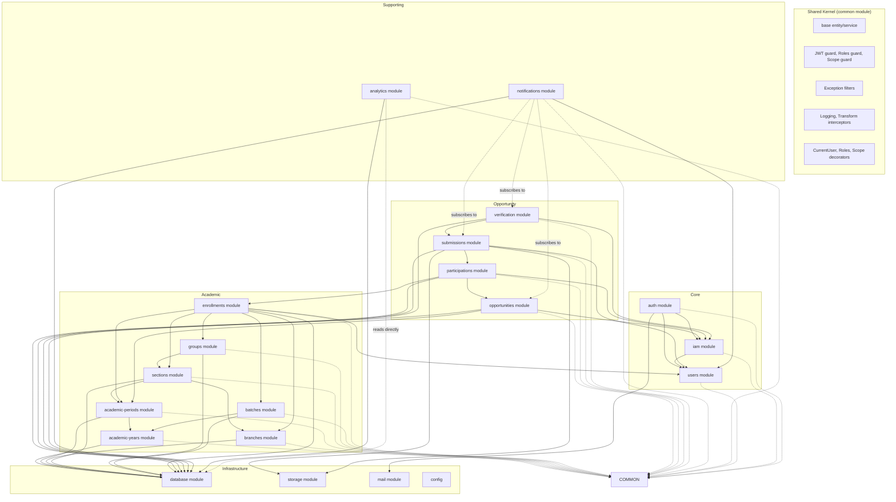

# NestJS Backend Architecture

> **Version:** 1.0  
> **Style:** Modular Monolith  
> **Stack:** NestJS, TypeORM, PostgreSQL, JWT  
> **Dependencies:** `ARCHITECTURE.md` (domain model), `SCHEMA.md` (entities), `AUTH-DESIGN.md` (auth flows)

---

## 1. Folder Structure

```
src/
├── main.ts                          # Bootstrap, validation pipe, swagger
├── app.module.ts                    # Root module — imports all modules
│
├── config/                          # Configuration schema & loading
│   ├── config.module.ts
│   ├── config.service.ts
│   ├── database.config.ts
│   ├── jwt.config.ts
│   ├── storage.config.ts
│   └── mail.config.ts
│
├── common/                          # Shared Kernel — no business logic
│   ├── common.module.ts             #   Exports all shared providers
│   ├── base/
│   │   ├── base.entity.ts           #   id, createdAt, updatedAt
│   │   └── base.service.ts          #   CRUD template methods
│   ├── decorators/
│   │   ├── current-user.decorator.ts
│   │   ├── roles.decorator.ts
│   │   └── scope.decorator.ts
│   ├── guards/
│   │   ├── jwt-auth.guard.ts
│   │   ├── roles.guard.ts
│   │   └── scope.guard.ts
│   ├── filters/
│   │   ├── http-exception.filter.ts
│   │   ├── validation-exception.filter.ts
│   │   └── query-failed.filter.ts
│   ├── interceptors/
│   │   ├── logging.interceptor.ts
│   │   ├── transform.interceptor.ts
│   │   └── timeout.interceptor.ts
│   ├── interfaces/
│   │   ├── i-event-publisher.ts
│   │   ├── i-file-store.ts
│   │   └── i-mailer.ts
│   └── pipes/
│       └── uuid-validation.pipe.ts
│
├── modules/
│   ├── auth/                        # Authentication — login, tokens, password reset
│   │   ├── auth.module.ts
│   │   ├── auth.service.ts
│   │   ├── auth.controller.ts
│   │   ├── dto/
│   │   │   ├── login.dto.ts
│   │   │   ├── refresh.dto.ts
│   │   │   ├── reset-password-request.dto.ts
│   │   │   ├── reset-password.dto.ts
│   │   │   ├── change-password.dto.ts
│   │   │   └── logout.dto.ts
│   │   ├── strategies/
│   │   │   └── jwt.strategy.ts
│   │   ├── entities/
│   │   │   ├── refresh-token.entity.ts
│   │   │   └── password-reset-token.entity.ts
│   │   └── events/
│   │       ├── user-logged-in.event.ts
│   │       └── password-changed.event.ts
│   │
│   ├── iam/                         # Identity & Access Management
│   │   ├── iam.module.ts
│   │   ├── iam.service.ts
│   │   ├── iam.controller.ts
│   │   ├── entities/
│   │   │   └── role-assignment.entity.ts
│   │   ├── dto/
│   │   │   ├── assign-role.dto.ts
│   │   │   ├── revoke-role.dto.ts
│   │   │   └── role-response.dto.ts
│   │   └── events/
│   │       ├── role-assigned.event.ts
│   │       └── role-revoked.event.ts
│   │
│   ├── users/                       # User management
│   │   ├── users.module.ts
│   │   ├── users.service.ts
│   │   ├── users.controller.ts
│   │   ├── entities/
│   │   │   └── user.entity.ts
│   │   └── dto/
│   │       ├── create-user.dto.ts
│   │       ├── update-user.dto.ts
│   │       └── user-response.dto.ts
│   │
│   ├── academic-years/
│   │   ├── academic-years.module.ts
│   │   ├── academic-years.service.ts
│   │   ├── academic-years.controller.ts
│   │   ├── entities/
│   │   │   └── academic-year.entity.ts
│   │   └── dto/
│   │       ├── create-academic-year.dto.ts
│   │       └── academic-year-response.dto.ts
│   │
│   ├── academic-periods/
│   │   ├── academic-periods.module.ts
│   │   ├── academic-periods.service.ts
│   │   ├── academic-periods.controller.ts
│   │   ├── entities/
│   │   │   └── academic-period.entity.ts
│   │   └── dto/
│   │       ├── create-academic-period.dto.ts
│   │       └── academic-period-response.dto.ts
│   │
│   ├── branches/
│   │   ├── branches.module.ts
│   │   ├── branches.service.ts
│   │   ├── branches.controller.ts
│   │   ├── entities/
│   │   │   └── branch.entity.ts
│   │   └── dto/
│   │       ├── create-branch.dto.ts
│   │       └── branch-response.dto.ts
│   │
│   ├── sections/
│   │   ├── sections.module.ts
│   │   ├── sections.service.ts
│   │   ├── sections.controller.ts
│   │   ├── entities/
│   │   │   └── section.entity.ts
│   │   └── dto/
│   │       ├── create-section.dto.ts
│   │       └── section-response.dto.ts
│   │
│   ├── groups/
│   │   ├── groups.module.ts
│   │   ├── groups.service.ts
│   │   ├── groups.controller.ts
│   │   ├── entities/
│   │   │   └── group.entity.ts
│   │   └── dto/
│   │       ├── create-group.dto.ts
│   │       └── group-response.dto.ts
│   │
│   ├── batches/
│   │   ├── batches.module.ts
│   │   ├── batches.service.ts
│   │   ├── batches.controller.ts
│   │   ├── entities/
│   │   │   └── batch.entity.ts
│   │   └── dto/
│   │       ├── create-batch.dto.ts
│   │       └── batch-response.dto.ts
│   │
│   ├── enrollments/
│   │   ├── enrollments.module.ts
│   │   ├── enrollments.service.ts
│   │   ├── enrollments.controller.ts
│   │   ├── entities/
│   │   │   └── enrollment.entity.ts
│   │   └── dto/
│   │       ├── create-enrollment.dto.ts
│   │       ├── bulk-create-enrollment.dto.ts
│   │       └── enrollment-response.dto.ts
│   │
│   ├── opportunities/
│   │   ├── opportunities.module.ts
│   │   ├── opportunities.service.ts
│   │   ├── opportunities.controller.ts
│   │   ├── entities/
│   │   │   ├── opportunity.entity.ts
│   │   │   └── opportunity-target.entity.ts
│   │   ├── dto/
│   │   │   ├── create-opportunity.dto.ts
│   │   │   ├── update-opportunity.dto.ts
│   │   │   └── opportunity-response.dto.ts
│   │   └── events/
│   │       ├── opportunity-published.event.ts
│   │       ├── opportunity-opened.event.ts
│   │       └── opportunity-closed.event.ts
│   │
│   ├── participations/
│   │   ├── participations.module.ts
│   │   ├── participations.service.ts
│   │   ├── participations.controller.ts
│   │   ├── entities/
│   │   │   └── participation.entity.ts
│   │   ├── dto/
│   │   │   └── participation-response.dto.ts
│   │   └── events/
│   │       └── participation-started.event.ts
│   │
│   ├── submissions/
│   │   ├── submissions.module.ts
│   │   ├── submissions.service.ts
│   │   ├── submissions.controller.ts
│   │   ├── entities/
│   │   │   ├── submission.entity.ts
│   │   │   ├── submission-file.entity.ts
│   │   │   └── file-reference.entity.ts
│   │   ├── dto/
│   │   │   ├── create-submission.dto.ts
│   │   │   └── submission-response.dto.ts
│   │   └── events/
│   │       └── submission-created.event.ts
│   │
│   ├── verification/
│   │   ├── verification.module.ts
│   │   ├── verification.service.ts
│   │   ├── verification.controller.ts
│   │   ├── entities/
│   │   │   └── verification-log.entity.ts
│   │   ├── dto/
│   │   │   └── verify-submission.dto.ts
│   │   └── events/
│   │       ├── submission-verified.event.ts
│   │       ├── submission-rejected.event.ts
│   │       ├── verification-escalated.event.ts
│   │       └── verification-overridden.event.ts
│   │
│   ├── notifications/
│   │   ├── notifications.module.ts
│   │   ├── notifications.service.ts
│   │   ├── notifications.controller.ts
│   │   ├── entities/
│   │   │   └── notification.entity.ts
│   │   ├── dto/
│   │   │   └── notification-response.dto.ts
│   │   └── subscribers/
│   │       ├── submission-created.subscriber.ts
│   │       ├── submission-verified.subscriber.ts
│   │       └── opportunity-published.subscriber.ts
│   │
│   ├── analytics/
│   │   ├── analytics.module.ts
│   │   ├── analytics.service.ts
│   │   ├── analytics.controller.ts
│   │   └── dto/
│   │       ├── section-analytics.dto.ts
│   │       ├── opportunity-analytics.dto.ts
│   │       └── batch-analytics.dto.ts
│   │
│   ├── database/
│   │   ├── database.module.ts
│   │   └── migrations/
│   │       └── (Flyway or TypeORM migrations)
│   │
│   ├── storage/
│   │   ├── storage.module.ts
│   │   └── storage.service.ts        # S3 adapter — presigned URLs
│   │
│   └── mail/
│       ├── mail.module.ts
│       └── mail.service.ts           # Email adapter — SMTP / SendGrid
│
└── scripts/
    ├── seed.ts                       # Seed admin user, branches, academic years
    └── migrate.ts                    # Migration runner
```

---

## 2. Module Dependency Diagram



### 2.1 Dependency Rules

| Rule | Enforced By |
|---|---|
| Modules may only import modules at the same or lower level in the dependency graph | Module imports in `@Module({ imports: [...] })` |
| Infrastructure modules never import business modules | Module metadata |
| `common/` is imported by every module — must have zero NestJS dependencies | Separate `CommonModule` with no `imports` |
| Analytics reads from DB directly — never imports business modules | Queries via `DataSource` or raw SQL |
| Notifications subscribes to events — never imports publishers directly | Event bus (`@nestjs/cqrs` or custom `EventEmitter`) |

---

## 3. Module Definitions

### 3.1 Core Modules

#### Users Module

| Aspect | Definition |
|---|---|
| **Responsibility** | Manages the User aggregate — identity, credentials, profile. The foundational module that every other module depends on. |
| **Entities** | `User` (maps to `users` table) |
| **Public API** | `UsersService.findById(id)` — resolves user by UUID; `UsersService.findByEmail(email)` — resolves user by normalized email; `UsersService.create(dto)` — creates user with hashed password; `UsersService.update(id, dto)` — updates profile fields; `UsersService.updatePassword(id, hash)` — password hash update only; `UsersService.deactivate(id)` — sets `is_active = FALSE` |
| **Controllers** | `UsersController` — CRUD endpoints for user management (admin only) |
| **Services** | `UsersService` — user lifecycle management; `PasswordService` — bcrypt hashing/verification (extracted to allow independent testing) |
| **Repositories** | `UsersRepository` (TypeORM `Repository<User>`) |
| **DTOs** | `CreateUserDto` (email, password, name, contactPhone), `UpdateUserDto` (name, contactPhone, isActive), `UserResponseDto` (id, email, name, isActive, roles, createdAt) |
| **Events** | None (user lifecycle events are internal) |
| **Dependencies** | `CommonModule`, `TypeOrmModule.forFeature([User])` |

#### IAM Module

| Aspect | Definition |
|---|---|
| **Responsibility** | Authorization infrastructure — role assignments, role querying, permission evaluation (PDP). All modules that need authorization checks depend on IAM. |
| **Entities** | `RoleAssignment` (maps to `role_assignments` table) |
| **Public API** | `IamService.getUserRoles(userId)` — returns active RoleAssignments for a user; `IamService.assignRole(dto)` — creates a RoleAssignment with scope; `IamService.revokeRole(id)` — sets `valid_to = NOW()`; `IamService.hasRole(userId, role, scopeType, scopeId)` — boolean check for PDP; `IamService.getEffectiveRoles(userId)` — returns flattened role list including inheritance (admin→mentor→TL) and implicit student role |
| **Controllers** | `IamController` — role CRUD (admin only), permission queries |
| **Services** | `RoleService` — manages RoleAssignment CRUD; `PermissionService` — implements Policy Decision Point (PDP), evaluates role hierarchy and scope matching |
| **Repositories** | `RoleAssignmentRepository` (TypeORM `Repository<RoleAssignment>`) |
| **DTOs** | `AssignRoleDto` (userId, role, scopeType, scopeId), `RevokeRoleDto` (assignmentId or userId+role+scope), `RoleResponseDto` (id, userId, role, scopeType, scopeId, validFrom, validTo) |
| **Events** | `RoleAssigned` (userId, role, scopeType, scopeId, assignedBy), `RoleRevoked` (userId, role, scopeType, scopeId, revokedBy) |
| **Dependencies** | `UsersModule`, `CommonModule`, `TypeOrmModule.forFeature([RoleAssignment])`. **Notably NOT** dependent on any academic module — scope validation (does section X exist?) is the caller's responsibility, enforced at the controller layer. |

**Why IAM doesn't depend on academic modules:** The `scope_id` in `role_assignments` is a UUID. IAM treats it as an opaque identifier. The controller that calls `assignRole(dto)` validates that `scope_id` corresponds to a real section/group by importing the relevant academic service. This keeps IAM agnostic of the academic hierarchy.

#### Auth Module

| Aspect | Definition |
|---|---|
| **Responsibility** | Authentication — login, token management, password reset, session revocation. Implements the flows defined in `AUTH-DESIGN.md`. |
| **Entities** | `RefreshToken` (maps to `refresh_tokens` table), `PasswordResetToken` (maps to `password_reset_tokens` table) |
| **Public API** | `AuthService.authenticate(login, password)` — validates credentials, resolves roles from IAM, issues tokens; `AuthService.refresh(refreshToken)` — validates and rotates refresh token, re-resolves roles; `AuthService.logout(userId, refreshToken)` — revokes specific session; `AuthService.logoutAll(userId)` — revokes all sessions; `AuthService.requestPasswordReset(email)` — creates reset token, triggers email; `AuthService.resetPassword(token, newPassword)` — validates token, updates password, revokes all sessions; `AuthService.changePassword(userId, currentPassword, newPassword)` — re-authenticates, updates password |
| **Controllers** | `AuthController` — all auth endpoints (public except change-password and logout) |
| **Services** | `AuthService` — orchestrates auth flows; `TokenService` — JWT generation/validation, refresh token hashing/storage; `PasswordService` (re-exported from Users or shared) |
| **Strategies** | `JwtStrategy` (passport-jwt) — extracts JWT from `Authorization` header, validates signature/expiry, attaches user to request |
| **DTOs** | `LoginDto` (login — email or roll number, password), `RefreshDto` (refreshToken), `ResetPasswordRequestDto` (email), `ResetPasswordDto` (token, newPassword), `ChangePasswordDto` (currentPassword, newPassword), `LogoutDto` (refreshToken) |
| **Events** | `UserLoggedIn` (userId, timestamp, ip), `PasswordChanged` (userId, timestamp) |
| **Dependencies** | `UsersModule` (credential lookup), `IamModule` (role resolution for JWT payload), `JwtModule` (from @nestjs/jwt — token signing), `MailModule` (password reset email), `CommonModule` |

---

### 3.2 Academic Modules

All academic modules follow an identical pattern. The table below defines each:

| Module | Entity | DB Table | Parent FK | Unique Constraint | Key Service Methods | Dependencies |
|---|---|---|---|---|---|---|
| `academic-years` | `AcademicYear` | `academic_years` | none | `label` | `findActive()`, `setActive(id)`, `create(dto)` | `CommonModule` |
| `academic-periods` | `AcademicPeriod` | `academic_periods` | `academic_year_id` | `(academic_year_id, label)` | `findByYear(yearId)`, `findActive()`, `getCurrent()` | `AcademicYearsModule` |
| `branches` | `Branch` | `branches` | none | `code`, `name` | `findAll()`, `findByCode(code)`, `create(dto)` | `CommonModule` |
| `sections` | `Section` | `sections` | `branch_id`, `academic_period_id`, `mentor_user_id` | `(academic_period_id, branch_id, code)` | `findByBranch(branchId)`, `findByMentor(userId)`, `findByPeriod(periodId)`, `getRoster(sectionId)` | `BranchesModule`, `AcademicPeriodsModule`, `UsersModule` |
| `groups` | `Group` | `groups` | `section_id`, `team_leader_user_id` | `(section_id, name)` | `findBySection(sectionId)`, `findByTL(userId)`, `getRoster(groupId)` | `SectionsModule`, `UsersModule` |
| `batches` | `Batch` | `batches` | `academic_year_id` | `(academic_year_id, label)` | `findByYear(yearId)`, `findByGraduationYear(year)` | `AcademicYearsModule` |
| `enrollments` | `Enrollment` | `enrollments` | `user_id`, `academic_period_id`, `branch_id`, `section_id`, `batch_id`, `group_id` | `(user_id, academic_period_id)` | `enrollStudent(dto)`, `bulkEnroll(dtos)`, `findBySection(sectionId)`, `findByGroup(groupId)`, `findByUser(userId)`, `getActiveEnrollment(userId)` | `UsersModule`, `AcademicPeriodsModule`, `BranchesModule`, `SectionsModule`, `GroupsModule`, `BatchesModule` |

**Enrollments Module — Special note:**
The `enrollments` module is the most complex academic module. It bridges the User aggregate to every academic dimension. The `bulkEnroll` method is the primary import path — it accepts a CSV/JSON array of student records, creates User records for unknown emails, and creates Enrollment records for each.

**Public API shape for all academic modules (standard CRUD):**
```
{Module}Service
  .create(dto) → entity
  .findById(id) → entity | null
  .findAll(filter?) → entity[]
  .update(id, dto) → entity
  .delete(id) → void       (admin only, hard delete for data errors)
  .{custom queries} → as defined above
```

---

### 3.3 Opportunity Modules

#### Opportunities Module

| Aspect | Definition |
|---|---|
| **Responsibility** | Manages the Opportunity aggregate — creation, lifecycle state machine, targeting. |
| **Entities** | `Opportunity` (maps to `opportunities`), `OpportunityTarget` (maps to `opportunity_targets`) |
| **Public API** | `OpportunitiesService.create(dto)` — creates opportunity with targets; `updateState(id, newState)` — transitions through Draft→Published→Open→Closed→Archived with authorization checks; `findByPeriod(periodId)` — period-scoped listing; `findVisible(userId)` — returns opportunities targeting user's enrollment; `getTargets(opportunityId)` — returns target entities |
| **Controllers** | `OpportunitiesController` — CRUD (admin), visibility queries (all roles) |
| **Services** | `OpportunitiesService` — lifecycle and CRUD; `TargetingService` — resolves which opportunities are visible to a given user based on their enrollment and `opportunity_targets` |
| **Repositories** | `OpportunitiesRepository` (TypeORM `Repository<Opportunity>`), `OpportunityTargetRepository` |
| **DTOs** | `CreateOpportunityDto` (title, description, type, opensAt, closesAt, targets[]), `UpdateOpportunityDto`, `OpportunityResponseDto` (with resolved target descriptions) |
| **Events** | `OpportunityPublished` (opportunityId, targets), `OpportunityOpened` (opportunityId), `OpportunityClosed` (opportunityId) |
| **Dependencies** | `AcademicPeriodsModule`, `IamModule` (role checks for state transitions), `CommonModule` |

#### Participations Module

| Aspect | Definition |
|---|---|
| **Responsibility** | Tracks the student journey through an opportunity. Provides the link between Opportunities and individual student Enrollments. |
| **Entities** | `Participation` (maps to `participations`) |
| **Public API** | `ParticipationsService.start(opportunityId, enrollmentId)` — creates participation with status `in_progress`; `getByOpportunity(opportunityId)` — roster for an opportunity; `getByUser(userId)` — user's participation history; `getPendingForTL(userId)` — submissions awaiting TL verification; `updateStatus(id, status)` — state machine transitions; `getSectionOverview(sectionId, opportunityId)` — mentor's section view |
| **Controllers** | `ParticipationsController` — student self-service (start, view own), TL/Mentor views |
| **Services** | `ParticipationsService` — participation lifecycle and queries; `ParticipationStateMachine` — validates status transitions |
| **Repositories** | `ParticipationsRepository` (TypeORM `Repository<Participation>`) |
| **DTOs** | `ParticipationResponseDto` (opportunity details, student details, status, submission info) |
| **Events** | `ParticipationStarted` (participationId, opportunityId, enrollmentId) |
| **Dependencies** | `OpportunitiesModule` (FK + state validation — can't start a draft opportunity), `EnrollmentsModule` (FK), `IamModule` (TL resolution from enrollment→group), `CommonModule` |

#### Submissions Module

| Aspect | Definition |
|---|---|
| **Responsibility** | Manages student submissions — proof files, description, version history. Handles file upload via presigned URLs. |
| **Entities** | `Submission` (maps to `submissions`), `SubmissionFile` (maps to `submission_files`), `FileReference` (maps to `file_references`) |
| **Public API** | `SubmissionsService.create(dto)` — creates submission tied to a participation; `getByParticipation(participationId)` — version history; `getLatestByParticipation(participationId)` — current submission for verification; `requestUploadUrl(fileName, mimeType)` — generates presigned S3 URL; `confirmUpload(fileReferenceId)` — called after client uploads to S3 |
| **Controllers** | `SubmissionsController` — student submission endpoints; `FilesController` — presigned URL generation |
| **Services** | `SubmissionsService` — submission CRUD; `FileService` — S3 presigned URL generation, file reference management |
| **Repositories** | `SubmissionsRepository`, `SubmissionFileRepository`, `FileReferenceRepository` |
| **DTOs** | `CreateSubmissionDto` (participationId, description, fileKeys[], externalLinks[]), `SubmissionResponseDto` (with file URLs, participation status) |
| **Events** | `SubmissionCreated` (submissionId, participationId, submittedBy, timestamp) |
| **Dependencies** | `ParticipationsModule` (FK + status validation — can't submit to a closed opportunity), `UsersModule` (submitter FK), `StorageModule` (presigned URLs), `CommonModule` |

#### Verification Module

| Aspect | Definition |
|---|---|
| **Responsibility** | Verification workflow — TL acceptance/rejection, escalation, mentor override, auto-verification. Implements the escalation flow from `ARCHITECTURE.md` §7. |
| **Entities** | `VerificationLog` (maps to `verification_logs`) |
| **Public API** | `VerificationService.verify(submissionId, userId, action)` — TL/Mentor accepts or rejects a submission; `getPendingForTL(userId)` — pending items across all opportunities; `getEscalationsForMentor(userId)` — escalated items needing mentor attention; `autoVerifyExpired()` — cron job for auto-verification of submissions past threshold; `escalate()` — cron job for escalation processing |
| **Controllers** | `VerificationController` — verify/reject endpoints (TL+); `EscalationController` — admin/mentor escalation views |
| **Services** | `VerificationService` — core verification logic; `EscalationService` — timer-based escalation processing; `VerificationCronService` — scheduled jobs for auto-verify and escalation |
| **Repositories** | `VerificationLogRepository` (TypeORM `Repository<VerificationLog>`) |
| **DTOs** | `VerifySubmissionDto` (submissionId, action — accept/reject, reason) |
| **Events** | `SubmissionVerified` (submissionId, verifiedBy, timestamp), `SubmissionRejected` (submissionId, rejectedBy, reason), `VerificationEscalated` (submissionId, fromUserId, toUserId), `VerificationOverridden` (submissionId, overriddenBy) |
| **Dependencies** | `SubmissionsModule` (submission lookup + participation status update), `IamModule` (role check — is user TL of this group?), `CommonModule` |

---

### 3.4 Notifications Module

| Aspect | Definition |
|---|---|
| **Responsibility** | Subscribes to domain events and creates notification records. Sends email via the Mail module. Provides in-app notification inbox. |
| **Entities** | `Notification` (maps to `notifications`) |
| **Public API** | `NotificationsService.getForUser(userId, pagination)` — paginated notification inbox; `getUnreadCount(userId)` — badge count; `markRead(notificationId)` — mark single; `markAllRead(userId)` — mark all as read |
| **Controllers** | `NotificationsController` — user notification inbox endpoints |
| **Subscribers** | `SubmissionCreatedSubscriber` → notify TL (in-app + email); `SubmissionVerifiedSubscriber` → notify student (in-app + email); `SubmissionRejectedSubscriber` → notify student (in-app + email); `OpportunityPublishedSubscriber` → notify targeted students (in-app + email); `VerificationEscalatedSubscriber` → notify mentor (in-app + email) |
| **Services** | `NotificationsService` — CRUD for notifications; `NotificationDispatcher` — routes events to create notifications; `EmailDispatcher` — sends emails via `MailService` |
| **Repositories** | `NotificationsRepository` |
| **DTOs** | `NotificationResponseDto` (id, type, title, body, readAt, createdAt) |
| **Events** | None (consumes events, does not emit) |
| **Dependencies** | `UsersModule` (recipient resolution), `MailModule` (email sending), `CommonModule`. Event subscribers are registered with the event bus — no direct module imports to the event publishers |

---

### 3.5 Analytics Module

| Aspect | Definition |
|---|---|
| **Responsibility** | Read-only query layer for dashboards and reports. Never writes data. Queries materialized views or runs aggregation queries directly against PostgreSQL. |
| **Entities** | None — reads from database via `DataSource` or raw SQL, not TypeORM repositories |
| **Public API** | `AnalyticsService.getSectionDashboard(sectionId, periodId)` — participation rates, completion rates, pending verifications per opportunity; `getOpportunityCompletion(opportunityId)` — breakdown by branch/section/group; `getBatchComparison(batchIds, periodId)` — cross-batch participation rates; `getTLPerformance(tlUserId, periodId)` — avg verification time, pending count, escalation rate; `getStudentProgress(userId)` — tracked opportunities, completion %, classification; `exportSubmissions(opportunityId, format)` — CSV/JSON export |
| **Controllers** | `AnalyticsController` — dashboard endpoints (role-gated: section view for mentors, global for admin) |
| **Services** | `AnalyticsService` — coordinates queries; `DashboardService` — pre-cached dashboard data; `ExportService` — CSV/JSON generation |
| **DTOs** | `SectionAnalyticsDto`, `OpportunityAnalyticsDto`, `BatchAnalyticsDto`, `StudentProgressDto` (all read-only, no validation decorators needed) |
| **Events** | None |
| **Dependencies** | `TypeOrmModule` (or `DataSource` injection) — reads from materialized views and transactional tables via raw queries. Does NOT import any business module to avoid circular dependencies |

---

### 3.6 Infrastructure Modules

#### Database Module

| Aspect | Definition |
|---|---|
| **Responsibility** | TypeORM configuration, DataSource setup, migration running. Wraps `@nestjs/typeorm` TypeOrmModule with pre-configured options. |
| **Public API** | Exports `TypeOrmModule` configured for PostgreSQL. Provides `DataSource` for modules that need raw queries (Analytics). |
| **Services** | `DatabaseConfigService` — reads config from `ConfigService`, builds TypeORM options |
| **Dependencies** | `ConfigModule` |
| **Key configuration** | Host, port, database name, username, password, synchronize (false in production), migrations run, logging level |

#### Storage Module

| Aspect | Definition |
|---|---|
| **Responsibility** | Abstracts file storage behind the `IFileStore` interface. Provides presigned URL generation. |
| **Public API** | `StorageService.generateUploadUrl(fileName, mimeType, expiresIn?)` — returns presigned PUT URL + file identifier; `StorageService.generateDownloadUrl(fileRefId, expiresIn?)` — returns presigned GET URL; `StorageService.deleteFile(fileRefId)` — removes from storage + deletes reference |
| **Services** | `StorageService` — S3 client wrapper; `S3Adapter` — implements `IFileStore` interface |
| **Dependencies** | `ConfigModule` (bucket name, region, access keys) |

#### Mail Module

| Aspect | Definition |
|---|---|
| **Responsibility** | Sends transactional emails. Provides the `IMailer` interface for abstraction. |
| **Public API** | `MailService.send(options)` — sends email with to, subject, body (HTML or text); `MailService.sendTemplate(templateName, context, to)` — renders template and sends |
| **Services** | `MailService` — adapter to SMTP/SendGrid/Mailgun |
| **Dependencies** | `ConfigModule` (SMTP host, credentials, from address) |

---

## 4. Shared Kernel Design

### 4.1 Composition

```
src/common/
├── common.module.ts        # @Global() — exports all shared providers
├── base/
│   ├── base.entity.ts      # Abstract class with id, createdAt, updatedAt
│   └── base.service.ts     # Generic CRUD service (optional, for standard CRUD modules)
├── decorators/             # Reusable decorators for controllers and handlers
├── guards/                 # NestJS guards for route protection
├── filters/                # Exception filters — catch and format errors
├── interceptors/           # Cross-cutting concerns — logging, transformation
├── interfaces/             # Contracts for swappable infrastructure
└── pipes/                  # Custom validation pipes
```

### 4.2 Base Entity

All entities extend a common abstract class:

```
BaseEntity
  ├── id: UUID              # Primary key, generated by DB
  ├── createdAt: DateTime   # Set once on insert
  └── updatedAt: DateTime   # Updated by trigger or application on every update
```

TypeORM mapping: `@PrimaryGeneratedColumn('uuid')` on `id`, `@CreateDateColumn` on `createdAt`, `@UpdateDateColumn` on `updatedAt`.

### 4.3 Guard Pipeline

```
Incoming Request
      │
      ▼
┌─────────────────┐
│  JwtAuthGuard    │  (Global, registered in CommonModule)
│  - Extracts JWT  │
│  - Validates sig │
│  - Sets req.user │
└────────┬────────┘
         │
         ▼
┌─────────────────┐
│  RolesGuard      │  (Applied @UseGuards(RolesGuard) @Roles('mentor'))
│  - Reads @Roles  │
│  - Checks roles  │
│  from req.user   │
└────────┬────────┘
         │
         ▼
┌─────────────────┐
│  ScopeGuard      │  (Applied @UseGuards(ScopeGuard) @Scope('section'))
│  - Reads @Scope  │
│  - Extracts param│
│  - Validates     │
│    scope match   │
└────────┬────────┘
         │
         ▼
    Controller
```

All guards are defined in `common/guards/` and registered in `CommonModule`.

### 4.4 Shared Interfaces

```typescript
// src/common/interfaces/i-event-publisher.ts
interface IEventPublisher {
  publish(event: DomainEvent): void;
}

// src/common/interfaces/i-file-store.ts
interface IFileStore {
  getUploadUrl(key: string, contentType: string, expiresIn: number): Promise<string>;
  getDownloadUrl(key: string, expiresIn: number): Promise<string>;
  delete(key: string): Promise<void>;
}

// src/common/interfaces/i-mailer.ts
interface IMailer {
  send(to: string, subject: string, body: string): Promise<void>;
  sendTemplate(template: string, context: Record<string, any>, to: string): Promise<void>;
}
```

---

## 5. Exception Strategy

### 5.1 Exception Hierarchy

```
HttpException (NestJS built-in)
├── BadRequestException          # 400 — validation errors, malformed input
├── UnauthorizedException        # 401 — invalid credentials, expired token
├── ForbiddenException           # 403 — valid auth but insufficient permissions
├── NotFoundException            # 404 — entity not found
├── ConflictException            # 409 — duplicate enrollment, duplicate role
├── UnprocessableEntityException # 422 — domain rule violation (e.g., state transition)
├── TooManyRequestsException     # 429 — rate limit exceeded
└── InternalServerErrorException # 500 — unexpected errors
```

### 5.2 Standard Error Response Format

All exceptions are caught by `HttpExceptionFilter` and transformed into:

```json
{
  "statusCode": 400,
  "error": "Bad Request",
  "message": "Validation failed",
  "details": [
    { "field": "email", "message": "email must be a valid email address" }
  ],
  "timestamp": "2026-06-16T10:30:00Z",
  "path": "/api/v1/auth/login",
  "requestId": "req-uuid"
}
```

### 5.3 Filter Chain

| Filter | Scope | Responsibility |
|---|---|---|
| `HttpExceptionFilter` | Global | Catches all `HttpException`, formats to standard response |
| `ValidationExceptionFilter` | Global | Catches `ValidationError` arrays from `ValidationPipe`, formats field-level errors |
| `QueryFailedFilter` | Global | Catches TypeORM `QueryFailedError`, translates to user-friendly messages (unique violation → 409, FK violation → 422) |

### 5.4 Domain Exceptions

For business rule violations, modules throw named exceptions that extend `HttpException`:

```
OpportunityStateException     (extends BadRequestException) — invalid state transition
EnrollmentDuplicateException  (extends ConflictException)   — duplicate enrollment
VerificationAccessException   (extends ForbiddenException)  — not the TL of this group
SubmissionClosedException     (extends UnprocessableEntityException) — opportunity is closed
```

---

## 6. Validation Strategy

### 6.1 Pipeline

```
Request → Global ValidationPipe → Controller → Service
              │
              │  whitelist: true        — strips unknown properties
              │  forbidNonWhitelisted: true — rejects unknown properties
              │  transform: true        — auto-transform types (string → number, string → UUID)
              │  validationError: { target: false } — don't expose target object in errors
              ▼
         class-validator decorators on DTOs
```

### 6.2 DTO Validation Rules

| Decorator | Usage |
|---|---|
| `@IsString()`, `@IsEmail()`, `@IsUUID()`, `@IsInt()` | Type validation |
| `@IsOptional()`, `@IsNotEmpty()` | Presence rules |
| `@Min()`, `@Max()`, `@MinLength()`, `@MaxLength()` | Range/length constraints |
| `@Matches(/regex/)` | Pattern validation (e.g., roll number format) |
| `@ArrayNotEmpty()`, `@ArrayMaxSize()` | Array validation |
| `@ValidateNested()` | Nested DTO validation |
| `@IsEnum()` | ENUM value validation |

### 6.3 Module-Level Validation

Each DTO file in `{module}/dto/` uses class-validator decorators. No validation logic in controllers or services — the `ValidationPipe` handles it at the boundary.

```
// Example pattern — not code:

CreateOpportunityDto
  @IsString() @IsNotEmpty() @MaxLength(255)
  title: string

  @IsOptional() @IsString() @MaxLength(5000)
  description: string

  @IsEnum(OpportunityType)
  opportunityType: OpportunityType

  @IsOptional() @IsDateString()
  opensAt: string

  @ValidateNested({ each: true })
  targets: CreateOpportunityTargetDto[]
```

### 6.4 UUID Validation

`UuidValidationPipe` is a custom pipe for param validation:

```
@Param('id', UuidValidationPipe) id: string
```

Ensures all route parameters that should be UUIDs are validated before reaching the service layer.

---

## 7. Logging Strategy

### 7.1 Log Levels

| Level | Usage | Example |
|---|---|---|
| `ERROR` | Operational failures that need investigation | DB connection failure, unexpected exception |
| `WARN` | Recoverable issues, unusual conditions | Rate limit approaching, slow query detected |
| `INFO` | Business events, state transitions | User logged in, opportunity published, submission verified |
| `DEBUG` | Detailed flow tracing (disabled in production) | SQL queries, token validation steps |
| `VERBOSE` | Full request/response dump (development only) | |

### 7.2 Structured Log Format

All logs are structured JSON for ingestion by Elasticsearch / Loki / CloudWatch:

```json
{
  "timestamp": "2026-06-16T10:30:00.123Z",
  "level": "INFO",
  "context": "AuthService",
  "requestId": "req-uuid",
  "userId": "user-uuid",
  "message": "User logged in successfully",
  "metadata": {
    "loginMethod": "email",
    "ip": "192.168.1.1",
    "userAgent": "Mozilla/5.0..."
  }
}
```

### 7.3 LoggingInterceptor

A global interceptor that logs every request:

```
Incoming → [LoggingInterceptor]
  Log: INFO  → "Incoming request {method} {path}" with requestId
  Execute → [handler]
  Log: INFO  → "Response {statusCode} {duration}ms" with requestId
  Error → Log: ERROR → "Exception {exceptionName}: {message}" with stack trace
```

### 7.4 Logger Injection

NestJS built-in `Logger` is used throughout. Each service instantiates:

```typescript
private readonly logger = new Logger(OpportunitiesService.name);
```

### 7.5 Audit Events vs. Logs

| Type | Purpose | Retention | Searchable |
|---|---|---|---|
| Application logs | Debugging, monitoring | 30 days | Elasticsearch/Loki |
| Business audit events (AuditLog table) | Compliance, history | 3 years | SQL queries |
| Auth audit events (AUTH-DESIGN.md §10.7) | Security monitoring | 90 days | Stored in application logs with structured fields |

---

## 8. Configuration Strategy

### 8.1 Configuration Sources

| Source | Priority | Values |
|---|---|---|
| Environment variables | Highest | Secrets, per-environment overrides |
| `.env` file | Middle | Development defaults |
| Config class defaults | Lowest | Sensible defaults for local dev |

NestJS `@nestjs/config` loads from `.env` + environment variables, validated against a `ConfigSchema`.

### 8.2 Configuration Namespace

```
ConfigService
├── database
│   ├── host: string (default: 'localhost')
│   ├── port: number (default: 5432)
│   ├── username: string
│   ├── password: string
│   ├── database: string
│   └── ssl: boolean (default: false)
│
├── jwt
│   ├── secret: string
│   ├── accessTokenExpiry: string (default: '15m')
│   ├── refreshTokenExpiry: string (default: '7d')
│   └── issuer: string (default: 'placement-tracker')
│
├── storage
│   ├── endpoint: string
│   ├── region: string
│   ├── accessKeyId: string
│   ├── secretAccessKey: string
│   ├── bucket: string
│   ├── uploadUrlExpiry: number (seconds, default: 3600)
│   └── downloadUrlExpiry: number (seconds, default: 300)
│
├── mail
│   ├── host: string
│   ├── port: number
│   ├── username: string
│   ├── password: string
│   ├── fromAddress: string
│   └── templateDir: string (default: './templates/email')
│
├── app
│   ├── port: number (default: 3000)
│   ├── corsOrigin: string
│   ├── logLevel: string (default: 'info')
│   ├── baseUrl: string (for password reset links)
│   └── environment: 'development' | 'staging' | 'production'
│
└── auth
    ├── bcryptRounds: number (default: 12)
    ├── maxLoginAttempts: number (default: 5)
    ├── loginRateLimitMs: number (default: 900000) // 15 minutes
    └── passwordResetExpiryMs: number (default: 3600000) // 1 hour
```

### 8.3 Validation

Configuration values are validated at startup using `class-validator` on the config object. If any required variable is missing (e.g., `JWT_SECRET`), the application fails to start with a clear error message.

```
MISSING REQUIRED CONFIG: database.host, jwt.secret
```

### 8.4 Environment Variables

```bash
# Database
DB_HOST=localhost
DB_PORT=5432
DB_USERNAME=postgres
DB_PASSWORD=secret
DB_NAME=placement_tracker

# JWT
JWT_SECRET=your-256-bit-secret

# Storage (S3-compatible)
STORAGE_ENDPOINT=https://s3.amazonaws.com
STORAGE_REGION=us-east-1
STORAGE_ACCESS_KEY_ID=AKIA...
STORAGE_SECRET_ACCESS_KEY=...
STORAGE_BUCKET=placement-proofs

# Mail
MAIL_HOST=smtp.sendgrid.net
MAIL_PORT=587
MAIL_USERNAME=apikey
MAIL_PASSWORD=SG....
MAIL_FROM=noreply@college.edu

# App
APP_PORT=3000
APP_CORS_ORIGIN=https://placement.college.edu
APP_LOG_LEVEL=info
APP_BASE_URL=https://placement.college.edu
APP_ENV=production

# Auth
AUTH_BCRYPT_ROUNDS=12
```

---

## 9. AppModule Composition

```typescript
// app.module.ts — structural outline only

@Module({
  imports: [
    // Infrastructure — must be imported first for config availability
    ConfigModule.forRoot({ isGlobal: true, validationSchema }),
    DatabaseModule,       // TypeOrmModule.forRootAsync(...)
    StorageModule,
    MailModule,

    // Shared kernel — @Global() exports guards, decorators, filters
    CommonModule,

    // Core modules (no business dependencies)
    UsersModule,
    IamModule,
    AuthModule,

    // Academic modules (hierarchical)
    AcademicYearsModule,
    AcademicPeriodsModule,
    BranchesModule,
    SectionsModule,
    GroupsModule,
    BatchesModule,
    EnrollmentsModule,

    // Opportunity modules
    OpportunitiesModule,
    ParticipationsModule,
    SubmissionsModule,
    VerificationModule,

    // Supporting modules
    NotificationsModule,
    AnalyticsModule,
  ],
  providers: [
    { provide: APP_GUARD, useClass: JwtAuthGuard },     // Global auth guard
    { provide: APP_FILTER, useClass: HttpExceptionFilter },
    { provide: APP_FILTER, useClass: ValidationExceptionFilter },
    { provide: APP_FILTER, useClass: QueryFailedFilter },
    { provide: APP_INTERCEPTOR, useClass: LoggingInterceptor },
    { provide: APP_INTERCEPTOR, useClass: TransformInterceptor },
    { provide: APP_PIPE, useClass: ValidationPipe },    // Global validation
  ],
})
export class AppModule {}
```

---

## 10. Module Dependency Invariants

| Invariant | Enforced By | Violation Consequence |
|---|---|---|
| `CommonModule` has zero imports | Code review | Circular dependency risk |
| `AnalyticsModule` imports only `TypeOrmModule` | Code review + lint rule | Spanshot dependency on business modules |
| `IamModule` does not import academic modules | Code review | Couples authorization to academic hierarchy |
| `NotificationsModule` uses event bus, never direct module imports | Architecture test | Tight coupling to event publishers |
| Infrastructure modules (`Storage`, `Mail`) never import business modules | Code review | Infrastructure becomes non-reusable |
| `AuthModule` is the only module that imports `JwtModule` | Code review | Token concerns leak into business modules |
