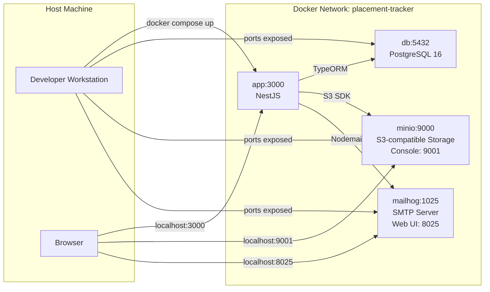
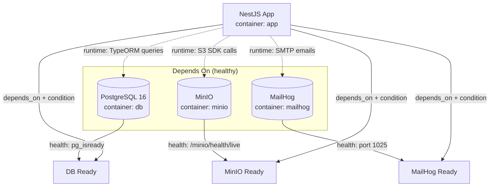
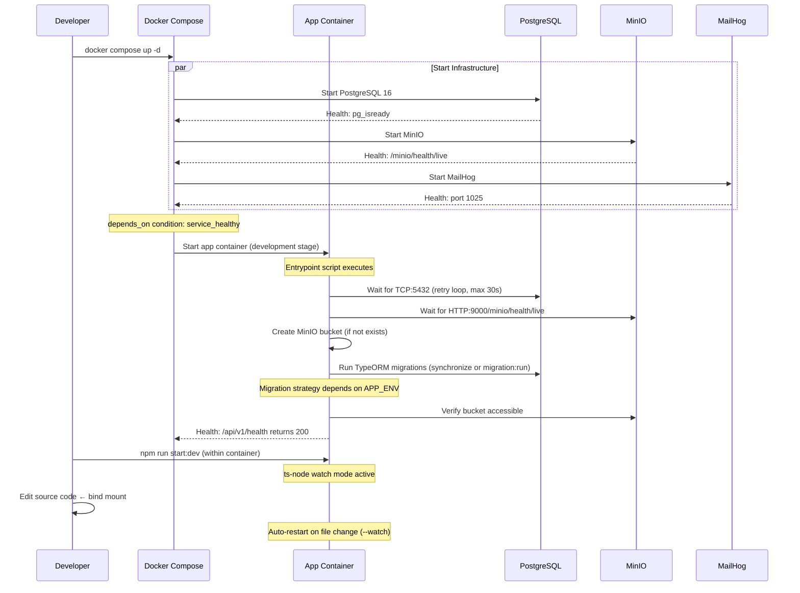
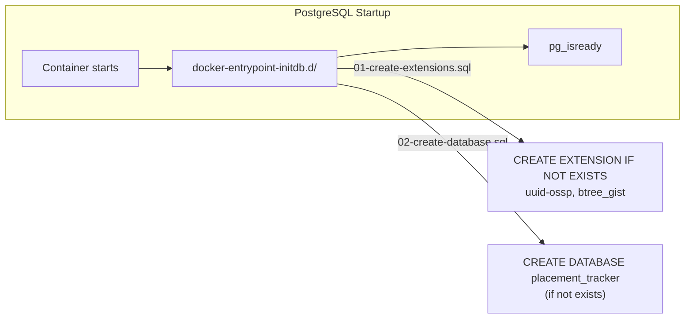
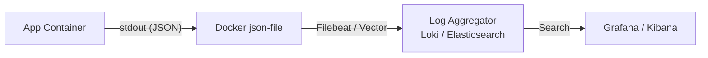
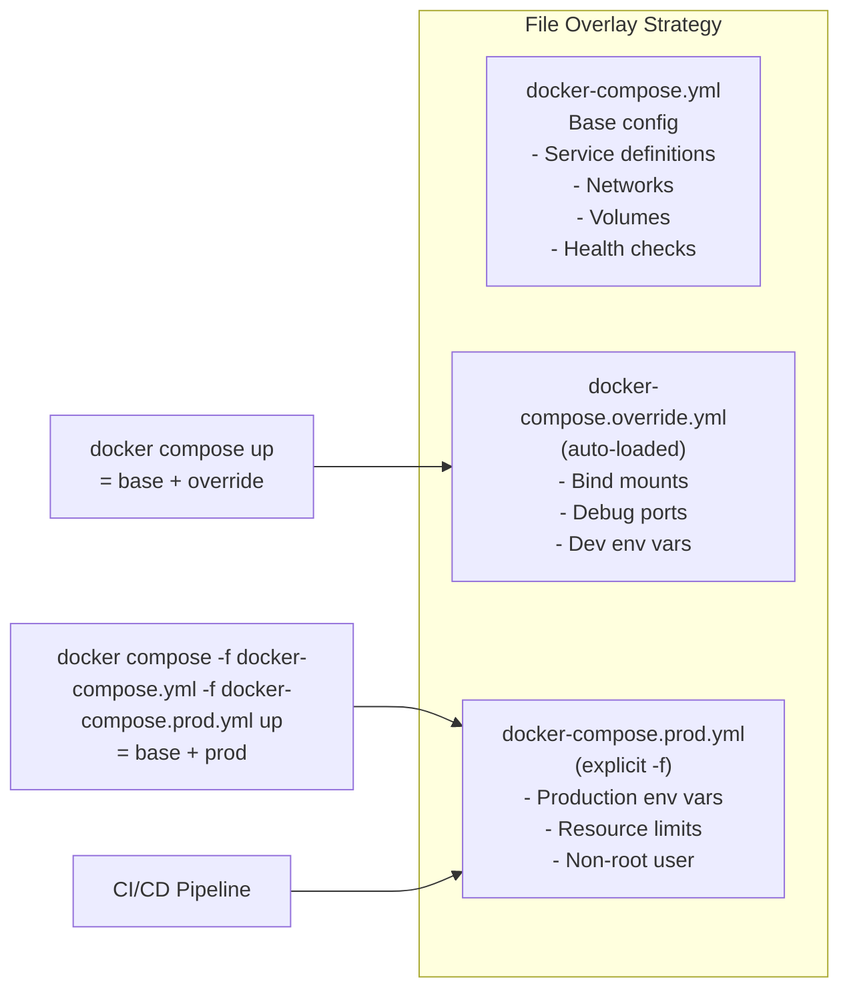

# Development Infrastructure Design

> **Version:** 1.0  
> **Stack:** Docker, Docker Compose, PostgreSQL 16, MinIO, MailHog  
> **Inputs:** `BACKEND-ARCHITECTURE.md` §8 (Configuration), `AUTH-DESIGN.md` (Auth flows)

---

## 1. Docker Architecture

### 1.1 Container Topology



### 1.2 Service Dependency Graph



### 1.3 Multi-Stage Build Architecture

```
Dockerfile (single source of truth for all stages)
│
├── stage: base
│   ├── FROM node:20-alpine
│   ├── WORKDIR /app
│   ├── Install system dependencies (tzdata, curl for healthcheck)
│   └── Non-root user (node)
│
├── stage: deps
│   ├── FROM base
│   ├── COPY package*.json ./
│   └── RUN npm ci (all dependencies including dev)
│
├── stage: build
│   ├── FROM deps
│   ├── COPY . .
│   └── RUN npm run build (tsc → dist/)
│
├── stage: development
│   ├── FROM deps
│   ├── COPY entrypoint.dev.sh /entrypoint.sh
│   ├── HEALTHCHECK --interval=30s --timeout=10s --retries=3
│   │   CMD curl -f http://localhost:3000/api/v1/health || exit 1
│   └── ENTRYPOINT ["/entrypoint.sh"]
│   │   └── CMD ["npm", "run", "start:dev"]
│   │
│   └── Runtime behavior:
│       - Source code mounted as bind mount (hot reload)
│       - Dev dependencies available (ts-node, nest CLI)
│       - Debug port 9229 exposed
│
└── stage: production
    ├── FROM base (fresh, minimal image)
    ├── COPY --from=build /app/dist ./dist
    ├── COPY --from=deps /app/node_modules ./node_modules
    │   (or RUN npm ci --only=production for smaller image)
    ├── COPY entrypoint.prod.sh /entrypoint.sh
    ├── HEALTHCHECK --interval=30s --timeout=10s --retries=3
    │   CMD curl -f http://localhost:3000/api/v1/health || exit 1
    ├── USER node (non-root)
    ├── ENTRYPOINT ["/entrypoint.sh"]
    └── CMD ["node", "dist/main.js"]
```

**Key design decisions:**
- **Single Dockerfile** with target stages, not separate Dockerfile.dev / Dockerfile.prod. Build selection via `docker compose --profile` or `target:` in compose.
- **Alpine-based** for minimal image size (~150MB production, ~400MB development).
- **Non-root user** in production (security best practice). Development runs as root for filesystem compatibility with bind mounts.
- **Separate entrypoints** for dev vs prod — the dev entrypoint waits for dependencies before starting the watcher.

---

## 2. Container Layout

### 2.1 Service Definitions

#### App (NestJS)

| Property | Development | Production |
|---|---|---|
| Build target | `development` | `production` |
| Port mapping | `3000:3000`, `9229:9229` (debug) | `3000:3000` |
| Source mount | Bind mount `./:/app` (src only) | None |
| Restart policy | `unless-stopped` | `always` |
| Resource limits | None | CPU: 1.0, Memory: 512MB |
| User | `root` (bind mount compat) | `node` |
| Profiles | `all` (default) | `prod` |

#### Database (PostgreSQL 16)

| Property | Development | Production |
|---|---|---|
| Image | `postgis/postgres:16` (postgis optional) | `postgres:16-alpine` or managed RDS |
| Port mapping | `5432:5432` | None (internal only) |
| Volume | `pgdata:/var/lib/postgresql/data` | Named volume or EBS |
| Restart policy | `unless-stopped` | `always` |
| Resource limits | None | CPU: 2.0, Memory: 1GB |
| Profiles | `all` (default) | `prod` (or external) |

#### Storage (MinIO)

| Property | Development | Production |
|---|---|---|
| Image | `minio/minio:latest` | `minio/minio:latest` or AWS S3 (external) |
| Port mapping | `9000:9000` (API), `9001:9001` (console) | `9000:9000` (API only) |
| Volume | `minio-data:/data` | Named volume or EBS |
| Command | `server /data --console-address ":9001"` | `server /data` |
| Environment | `MINIO_ROOT_USER`, `MINIO_ROOT_PASSWORD` | Via secrets |
| Profiles | `all` (default) | `prod` (or external) |

#### MailHog (Email Testing)

| Property | Development | Production |
|---|---|---|
| Image | `mailhog/mailhog:latest` | External SMTP (SendGrid, SES) |
| Port mapping | `1025:1025` (SMTP), `8025:8025` (Web UI) | None |
| Volume | None (ephemeral) | N/A |
| Profiles | `all` (default) | Not used in production |

### 2.2 Network Configuration

```
Single bridge network: placement-tracker-net
  - Driver: bridge
  - Internal: false (containers need outbound access for npm/pip)
  - No external DNS dependency — all service discovery via container names
```

**Container-to-container DNS (Docker Compose internal):**
| Hostname | Resolves To |
|---|---|
| `db` | PostgreSQL container |
| `minio` | MinIO container |
| `mailhog` | MailHog container |
| `app` | NestJS container |

---

## 3. Environment Variable Specification

### 3.1 Variable Naming

| Convention | Example | Source |
|---|---|---|
| `DB_*` | `DB_HOST`, `DB_PORT` | Backend config §8.2 |
| `JWT_*` | `JWT_SECRET`, `JWT_ACCESS_EXPIRY` | Backend config §8.2 |
| `STORAGE_*` | `STORAGE_ENDPOINT`, `STORAGE_BUCKET` | Backend config §8.2 |
| `MAIL_*` | `MAIL_HOST`, `MAIL_FROM` | Backend config §8.2 |
| `APP_*` | `APP_PORT`, `APP_ENV` | Backend config §8.2 |
| `AUTH_*` | `AUTH_BCRYPT_ROUNDS` | Backend config §8.2 |
| `MINIO_*` | `MINIO_ROOT_USER`, `MINIO_ROOT_PASSWORD` | MinIO container |
| `POSTGRES_*` | `POSTGRES_DB`, `POSTGRES_PASSWORD` | PostgreSQL container |

### 3.2 Environment File Specification

```bash
# ============================================================
# App Environment (read by NestJS ConfigService)
# ============================================================
# Database
DB_HOST=db                          # Container name; 'localhost' when running outside Docker
DB_PORT=5432
DB_USERNAME=postgres
DB_PASSWORD=dev_password_only
DB_NAME=placement_tracker
DB_SSL=false                        # No SSL between containers in dev

# JWT
JWT_SECRET=dev-jwt-secret-min-32-chars-long-for-hs256
JWT_ACCESS_EXPIRY=15m
JWT_REFRESH_EXPIRY=7d
JWT_ISSUER=placement-tracker-dev

# Storage (MinIO)
STORAGE_ENDPOINT=http://minio:9000  # Container name; protocol + host + port
STORAGE_REGION=us-east-1            # MinIO accepts any region
STORAGE_ACCESS_KEY_ID=minioadmin
STORAGE_SECRET_ACCESS_KEY=minioadmin
STORAGE_BUCKET=placement-proofs
STORAGE_UPLOAD_URL_EXPIRY=3600      # 1 hour
STORAGE_DOWNLOAD_URL_EXPIRY=300     # 5 minutes
STORAGE_USE_SSL=false               # No SSL between containers in dev

# Mail
MAIL_HOST=mailhog                   # Container name
MAIL_PORT=1025
MAIL_USERNAME=                      # MailHog doesn't require auth
MAIL_PASSWORD=
MAIL_FROM=noreply@placement.local
MAIL_TEMPLATE_DIR=./templates/email

# App
APP_PORT=3000
APP_CORS_ORIGIN=http://localhost:5173    # Vite dev server
APP_LOG_LEVEL=debug
APP_BASE_URL=http://localhost:3000
APP_ENV=development

# Auth
AUTH_BCRYPT_ROUNDS=10               # Lower for faster dev iteration (12 for production)
AUTH_MAX_LOGIN_ATTEMPTS=10          # Higher for dev convenience
AUTH_LOGIN_RATE_LIMIT_MS=1000       # 1 second in dev
AUTH_PASSWORD_RESET_EXPIRY_MS=3600000

# ============================================================
# PostgreSQL Environment (read by PostgreSQL container)
# ============================================================
POSTGRES_DB=placement_tracker
POSTGRES_USER=postgres
POSTGRES_PASSWORD=dev_password_only

# ============================================================
# MinIO Environment (read by MinIO container)
# ============================================================
MINIO_ROOT_USER=minioadmin
MINIO_ROOT_PASSWORD=minioadmin
```

### 3.3 Environment Precedence

```
1. docker compose run -e VAR=value           # Highest
2. docker compose.yml environment: block      # Per-service overrides
3. docker compose.yml env_file: .env          # File reference
4. Defaults in Dockerfile ENV directives      # Lowest
```

### 3.4 Sensitive Variables (Marked `.env.example` as "REQUIRED")

```bash
# Variables that MUST be changed from defaults in production:
DB_PASSWORD="REQUIRED"
JWT_SECRET="REQUIRED - generate with: openssl rand -hex 32"
STORAGE_ACCESS_KEY_ID="REQUIRED"
STORAGE_SECRET_ACCESS_KEY="REQUIRED"
MINIO_ROOT_PASSWORD="REQUIRED"
```

---

## 4. Local Development Workflow

### 4.1 Start Sequences



### 4.2 Common Commands

| Task | Command |
|---|---|
| Start all services | `docker compose up -d` |
| Start only database services | `docker compose up -d db minio mailhog` |
| View app logs | `docker compose logs -f app` |
| Execute migration | `docker compose exec app npm run migration:run` |
| Generate migration | `docker compose exec app npm run migration:generate -- src/database/migrations/MigrationName` |
| Revert last migration | `docker compose exec app npm run migration:revert` |
| Open psql shell | `docker compose exec db psql -U postgres placement_tracker` |
| Open MinIO console | Open `http://localhost:9001` in browser |
| Open MailHog UI | Open `http://localhost:8025` in browser |
| View running containers | `docker compose ps` |
| Rebuild app image | `docker compose build app` |
| Reset database | `docker compose down -v && docker compose up -d` (CAUTION: destroys data) |
| Attach debugger | `node --inspect=0.0.0.0:9229` (port mapped to host) |
| Run tests | `docker compose exec app npm test` |
| Run linter | `docker compose exec app npm run lint` |

### 4.3 Debugging Configuration

| Tool | Port | Configuration |
|---|---|---|
| Chrome DevTools | `9229` | Connect to `chrome://inspect` → `localhost:9229` |
| VS Code | `9229` | `.vscode/launch.json`: `{ "type": "node", "request": "attach", "address": "localhost", "port": 9229 }` |
| WebStorm | `9229` | Run Configuration: Attach to Node.js/Chrome |

### 4.4 Override File Structure

```yaml
# docker-compose.override.yml — automatically merged by Docker Compose
# Purpose: Development-specific overrides (bind mounts, debug ports, profiles)
# This file is NOT committed (in .gitignore) for team-specific overrides
# OR committed with sensible defaults^[For the development version of this file, see discussion in §1]
```

The override pattern:
- `docker-compose.yml`: Base configuration shared across all environments
- `docker-compose.override.yml`: Development-specific config (auto-loaded, not committed)
- `docker-compose.prod.yml`: Production-specific config (explicitly loaded with `-f` flag)

---

## 5. PostgreSQL Setup

### 5.1 Container Configuration

| Parameter | Development | Production |
|---|---|---|
| Image | `postgres:16-alpine` | `postgres:16-alpine` or managed (RDS/Cloud SQL) |
| Port | `5432:5432` (host accessible) | Internal only |
| Data directory | `/var/lib/postgresql/data` | Same |
| Locale | `en_US.UTF-8` | `en_US.UTF-8` |
| Extensions | `uuid-ossp`, `btree_gist` (for role_assignments exclusion constraint) | Same |
| Max connections | 100 | 200 |
| Shared buffers | 128MB | 1GB (or 25% of RAM) |

### 5.2 Initialization



**Initialization scripts location:** `infrastructure/docker/db/init/`

| Script | Content |
|---|---|
| `01-extensions.sql` | `CREATE EXTENSION IF NOT EXISTS "uuid-ossp"; CREATE EXTENSION IF NOT EXISTS "btree_gist";` |
| `02-schema.sql` | (Optional — Flyway/TypeORM manages schema in production; dev can auto-sync) |

### 5.3 TypeORM Synchronization Strategy

| Environment | Strategy | Safe for Data? |
|---|---|---|
| Development | `synchronize: true` (auto-sync entities ↔ tables) | Yes — local data only |
| Staging | `synchronize: false` + `migrationsRun: true` | Yes — controlled migrations |
| Production | `synchronize: false` + manual `migration:run` | Required — human approval gate |

### 5.4 Data Persistence

- **Named volume**: `pgdata` — persists across container restarts
- **Destroy on**: `docker compose down -v` (intentional reset)
- **Backup not handled by Docker** — use `pg_dump` externally or managed DB snapshots

---

## 6. MinIO Setup

### 6.1 Container Configuration

| Parameter | Development | Production |
|---|---|---|
| Image | `minio/minio:latest` | `minio/minio:latest` or AWS S3 |
| API port | `9000:9000` | Internal or load balanced |
| Console port | `9001:9001` | Not exposed |
| Data directory | `/data` (mounted volume) | `/data` |
| Root credentials | `MINIO_ROOT_USER=minioadmin`, `MINIO_ROOT_PASSWORD=minioadmin` | Managed secrets |

### 6.2 Bucket Initialization

MinIO does not auto-create buckets. Two approaches:

**Approach A: Application-level (recommended for MVP)**
```
App entrypoint script checks if bucket exists via S3 API (HeadBucket)
If not found → CreateBucket
```

**Approach B: Init container with mc client (production-grade)**
```
mc alias set local http://minio:9000 $MINIO_ROOT_USER $MINIO_ROOT_PASSWORD
mc mb local/placement-proofs --ignore-existing
mc policy set download local/placement-proofs  (if public read needed)
```

Decision: **Approach A** for development (simpler, self-contained in app entrypoint). **Approach B** for production if self-hosting MinIO.

### 6.3 Bucket Policy

| Bucket | Access | Purpose |
|---|---|---|
| `placement-proofs` | Private (presigned URLs only) | Student uploads, proof files |
| `placement-exports` | Private (presigned URLs only) | Admin report exports |

### 6.4 Data Persistence

- **Named volume**: `minio-data` — persists uploads across restarts
- **No backup** — treat as ephemeral in development. In production, use S3 versioning + replication.

### 6.5 CORS Configuration

MinIO requires CORS configuration for browser-based uploads via presigned URLs:

```json
{
  "CORSRules": [{
    "AllowedOrigins": ["http://localhost:5173", "https://placement.college.edu"],
    "AllowedMethods": ["GET", "PUT", "POST"],
    "AllowedHeaders": ["*"],
    "ExposeHeaders": ["ETag"],
    "MaxAgeSeconds": 3600
  }]
}
```

Applied at MinIO startup via `mc` command or S3 API.

---

## 7. MailHog Setup

### 7.1 Container Configuration

| Parameter | Value |
|---|---|
| Image | `mailhog/mailhog:latest` |
| SMTP port | `1025:1025` |
| HTTP UI port | `8025:8025` |
| Storage | In-memory (ephemeral — messages lost on restart) |
| Auth | None (development only) |
| Data persistence | Not needed — email is ephemeral in dev |

### 7.2 Verification Flow

```
App sends email via Nodemailer
  → SMTP:1025 → MailHog captures it
  → Developer opens http://localhost:8025
  → Sees email in web UI with full headers and body
```

### 7.3 Production Replacement

In production, the `MAIL_HOST`/`MAIL_PORT` are switched to an external SMTP provider:

| Provider | Host | Port | Auth |
|---|---|---|---|
| SendGrid | `smtp.sendgrid.net` | 587 | API key |
| AWS SES | `email.us-east-1.amazonaws.com` | 587 | IAM credentials |
| SMTP (generic) | Configurable | 465/587 | Username + password |

The application code does not change — only environment variables.

---

## 8. Volume Strategy

### 8.1 Volume Inventory

| Volume Name | Container Mount | Purpose | Persistence | Backup |
|---|---|---|---|---|
| `pgdata` | `/var/lib/postgresql/data` | Database files | Required | `pg_dump` |
| `minio-data` | `/data` | Uploaded files | Required | S3 sync / rsync |
| (none) | `app` bind mount: `./src` → `/app/src` | Source code for hot reload | N/A | N/A |

### 8.2 Volume Declaration

```yaml
volumes:
  pgdata:
    driver: local
    # driver_opts:
    #   type: none
    #   device: /path/to/explicit/host/path  (optional for performance)
    #   o: bind

  minio-data:
    driver: local
```

### 8.3 Bind Mount Strategy

Only the `app` service uses a bind mount, and only in development:

| Host path | Container path | Purpose |
|---|---|---|
| `./src` | `/app/src` | TypeScript source files — changes trigger hot reload |
| `./package.json` | `/app/package.json` | Dependency changes |
| `./tsconfig.json` | `/app/tsconfig.json` | TypeScript config changes |
| `./nest-cli.json` | `/app/nest-cli.json` | NestJS CLI config |

**Not mounted in production** — the compiled `dist/` is baked into the image.

### 8.4 Volume Cleanup Policy

| Action | Command | Data Loss? |
|---|---|---|
| Stop containers | `docker compose down` | No — volumes preserved |
| Stop + remove volumes | `docker compose down -v` | **Yes** — database + files destroyed |
| Prune unused volumes | `docker volume prune` | Only orphaned volumes |
| Manual pg_dump | `docker compose exec db pg_dump -U postgres placement_tracker > backup.sql` | No |

---

## 9. Secrets Management Strategy

### 9.1 Development Secrets

```
.env (NOT committed — in .gitignore)
  └── Contains: DB_PASSWORD, JWT_SECRET, MINIO credentials
  
.env.example (committed)
  └── Contains: All keys with placeholder values, annotated as REQUIRED or DEFAULT
```

### 9.2 Production Secrets

| Approach | When to Use | Mechanism |
|---|---|---|
| Docker Secrets | Self-hosted with Docker Swarm | `/run/secrets/<secret_name>` mounted files |
| Environment Variables | Kubernetes, simple deployments | `env:` in compose or pod spec |
| Vault / AWS Secrets Manager | Enterprise | Sidecar injection or SDK |

**Recommended for this system (single college):** Environment variables injected by the deployment platform (Docker Compose in production, or a simple CI/CD pipeline). Secrets manager only if the college has compliance requirements.

### 9.3 Migration from Dev to Prod

```
.env (dev)                        K8s Secret / Docker Secret (prod)
  DB_PASSWORD=dev_pass      →     base64-encoded in Secret manifest
  JWT_SECRET=dev_secret     →     openssl rand -hex 32 | base64
  MINIO_ROOT_PASSWORD=dev   →     strong random password
```

### 9.4 Secrets That Should Never Be in VCS

```bash
DB_PASSWORD                # Database superuser password
JWT_SECRET                 # Token signing key — rotation compromises all tokens
STORAGE_ACCESS_KEY_ID       # Storage API access
STORAGE_SECRET_ACCESS_KEY   # Storage API secret
MINIO_ROOT_PASSWORD        # MinIO admin (if self-hosted)
MAIL_PASSWORD              # SMTP credentials (if applicable)
```

---

## 10. Health Check Strategy

### 10.1 Health Check Endpoints

| Container | Type | Command / Endpoint | Interval | Timeout | Retries |
|---|---|---|---|---|---|
| `db` | Docker healthcheck | `pg_isready -U postgres` | 10s | 5s | 5 |
| `minio` | Docker healthcheck | `curl -f http://localhost:9000/minio/health/live` | 10s | 5s | 5 |
| `mailhog` | Docker healthcheck | `nc -z localhost 1025` | 30s | 5s | 3 |
| `app` | Application endpoint | `curl -f http://localhost:3000/api/v1/health` | 30s | 10s | 3 |

### 10.2 Application Health Endpoint

`GET /api/v1/health` returns:

```json
{
  "status": "ok",
  "timestamp": "2026-06-16T10:30:00Z",
  "version": "1.0.0",
  "checks": {
    "database": { "status": "ok", "latencyMs": 2 },
    "storage":  { "status": "ok", "latencyMs": 5 },
    "mail":     { "status": "ok", "latencyMs": 1 }
  }
}
```

Each check:
- **database**: `SELECT 1` — verifies connection pool has at least one working connection
- **storage**: `HeadBucket` — verifies MinIO/S3 bucket is accessible
- **mail**: Verifies SMTP connection (optional — skip if mail transport doesn't support quick ping)

Partial failure: If database is healthy but storage is slow, status is `degraded`.

### 10.3 Dependency Condition

```yaml
services:
  app:
    depends_on:
      db:
        condition: service_healthy
      minio:
        condition: service_healthy
      mailhog:
        condition: service_started    # Not critical — app can start without mail
```

### 10.4 Startup Grace Period

| Container | Startup Window | Rationale |
|---|---|---|
| `db` | 30s | First PostgreSQL start can be slow (initializing data directory) |
| `minio` | 15s | Fast startup |
| `mailhog` | 5s | Instant startup |
| `app` | 60s | Depends on 3 services + migration time |

---

## 11. Logging Strategy

### 11.1 Docker Log Driver

| Environment | Driver | Configuration |
|---|---|---|
| Development | `json-file` (default) | `max-size: 10m`, `max-file: 3` |
| Production | `json-file` | `max-size: 50m`, `max-file: 5` |

**Why not `journald` or `syslog`:** Docker's `json-file` is the lowest-common-denominator that works with all log aggregators (ELK, Loki, CloudWatch). The logs are structured JSON emitted by the application, so the driver format is irrelevant — the content is what matters.

### 11.2 Log Aggregation (Production)



**Not included in MVP compose file** — log aggregation is an operational concern added post-MVP. The app logs structured JSON to stdout. In production, a log shipper (Filebeat, Vector, Fluentd) tails the Docker logs and forwards them.

### 11.3 Log Volume Estimation

| Service | Logs per day (est.) | Storage (30 days) |
|---|---|---|
| `app` | ~50MB (5K users, ~100K requests/day) | 1.5GB |
| `db` | ~100MB (query logs disabled by default) | 3GB |
| `minio` | ~20MB (access logs) | 600MB |
| `mailhog` | Negligible | ~10MB |

### 11.4 Log Levels Per Environment

| Environment | App Log Level | DB Logging | MinIO Logging |
|---|---|---|---|
| Development | `debug` | All queries (`logging: 'all'` in TypeORM) | `ERROR` only |
| Staging | `info` | Slow queries only (>1s) | `WARN` |
| Production | `info` | Errors only (`logging: ['error']`) | `ERROR` |

---

## 12. Development vs Production Configuration

### 12.1 Configuration Matrix

| Aspect | Development | Production |
|---|---|---|
| **Dockerfile target** | `development` | `production` |
| **Source code** | Bind mount (hot reload) | Baked into image |
| **Debug port** | `9229:9229` | Not exposed |
| **Database** | Docker container `db:5432` | Managed service or container |
| **Storage** | MinIO container `minio:9000` | AWS S3 or MinIO cluster |
| **Email** | MailHog `mailhog:1025` (capture only) | SendGrid / SES |
| **DB sync** | `synchronize: true` | Off, manual migrations |
| **JWT secret** | Dev secret in `.env` | Strong random, in secrets manager |
| **CORS origin** | `http://localhost:5173` | `https://placement.college.edu` |
| **Log level** | `debug` | `info` |
| **bcrypt rounds** | 10 (fast) | 12 (secure) |
| **Rate limiting** | Relaxed (1 req/s) | Standard (10 req/min for auth) |
| **SSL** | None (internal network) | TLS everywhere |
| **User** | `root` | `node` (non-root) |
| **Resource limits** | Unlimited | CPU/Memory constrained |
| **Restart policy** | `unless-stopped` | `always` |
| **Profiles** | N/A | `--profile prod` |

### 12.2 Compose File Strategy



### 12.3 Startup Commands

```bash
# Development (override auto-loaded)
docker compose up -d

# Production
docker compose \
  -f docker-compose.yml \
  -f docker-compose.prod.yml \
  --profile prod \
  up -d

# Run one-off commands in production
docker compose \
  -f docker-compose.yml \
  -f docker-compose.prod.yml \
  exec app npm run migration:run
```

### 12.4 Environment Distinction in Application

The application distinguishes environments via `APP_ENV`:

```typescript
// Pseudocode showing the branching logic pattern
if (configService.get('app.environment') === 'development') {
  // Enable: synchronize, debug endpoints, relaxed rate limiting, CORS for localhost
} else {
  // Enable: strict CORS, full rate limiting, no debug endpoints
}
```

---

## 13. Infrastructure Folder Structure

```
infrastructure/
├── docker/
│   ├── app/
│   │   ├── Dockerfile              # Multi-stage (base → deps → build → dev → prod)
│   │   ├── entrypoint.dev.sh       # Dev entrypoint: wait, migrate, create bucket, start:dev
│   │   └── entrypoint.prod.sh      # Prod entrypoint: wait, migrate, start
│   │
│   ├── db/
│   │   └── init/
│   │       ├── 01-extensions.sql   # CREATE EXTENSION IF NOT EXISTS uuid-ossp, btree_gist
│   │       └── 02-schema.sql       # Optional: initial schema dump (dev bootstrap)
│   │
│   ├── minio/
│   │   └── init/
│   │       └── configure.sh        # Optional: mc alias, bucket creation, CORS policy
│   │
│   └── nginx/
│       └── nginx.conf              # Production: reverse proxy, SSL termination, gzip
│
├── docker-compose.yml              # Base: all service definitions
├── docker-compose.override.yml     # Dev overrides (in .gitignore)
├── docker-compose.prod.yml         # Prod overrides (committed)
│
├── .env.example                    # Documented environment variables with defaults
├── .gitignore                      # Includes .env, override.yml, node_modules
│
└── README.md                       # Setup instructions, common commands
```

### 13.1 .gitignore Rules

```gitignore
# Environment
.env

# Docker Compose overrides
docker-compose.override.yml

# Node (in case bind mount creates artifacts)
node_modules/
dist/
```

### 13.2 File Purpose Summary

| File | Committed? | Purpose |
|---|---|---|
| `Dockerfile` | Yes | Single source of truth for all build stages |
| `entrypoint.dev.sh` | Yes | Development startup orchestration |
| `entrypoint.prod.sh` | Yes | Production startup orchestration |
| `01-extensions.sql` | Yes | PostgreSQL extension bootstrap |
| `configure.sh` | Optional | MinIO bootstrap via mc client |
| `nginx.conf` | Yes | Production reverse proxy config |
| `docker-compose.yml` | Yes | Base service definitions |
| `docker-compose.override.yml` | **No** | Developer-specific overrides |
| `docker-compose.prod.yml` | Yes | Production overrides |
| `.env.example` | Yes | Documented template for local .env |
| `.env` | **No** | Actual secrets and local config |

---

## 14. Production Considerations (Not Implemented in MVP)

| Concern | MVP Approach | Production Upgrade |
|---|---|---|
| SSL termination | Direct HTTP (dev only) | Nginx reverse proxy with Let's Encrypt |
| Database connection pooling | TypeORM default pool (10) | PgBouncer sidecar for connection pooling |
| Read replicas | Single PostgreSQL instance | PgBouncer → primary + replicas |
| CDN for files | S3 presigned URLs | CloudFront CDN in front of S3 |
| Container orchestration | Docker Compose | Kubernetes (if multi-host needed) |
| CI/CD | Manual `docker compose build` | GitHub Actions → Docker registry → deploy |
| Monitoring | Docker logs only | Prometheus + Grafana metrics, Loki logs |
| Backup | Manual `pg_dump` | Automated pg_dump to S3 with point-in-time recovery |
| Image registry | Local Docker | ECR / Docker Hub |
| Blue-green deploy | Manual | Kubernetes rolling update |
