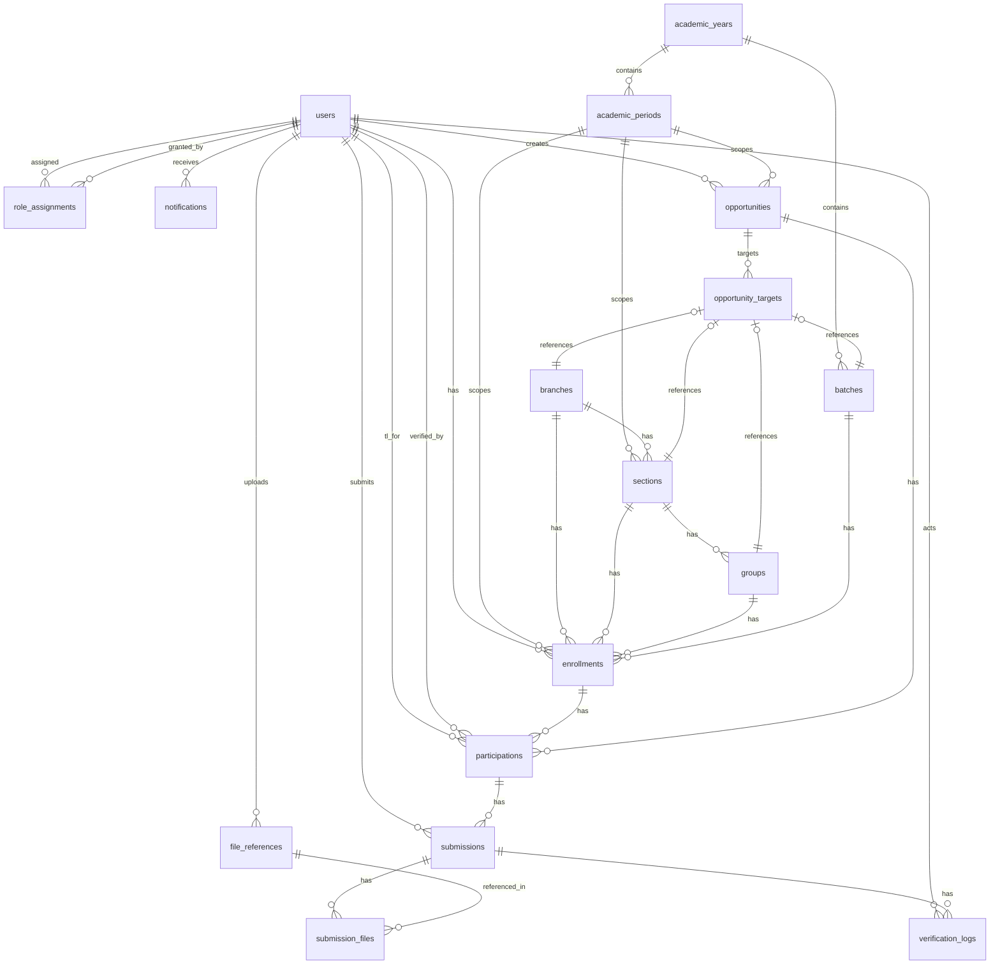

# Placement Opportunity Tracking and Monitoring System — PostgreSQL Schema Design

> **Version:** 1.0  
> **Target:** PostgreSQL 16  
> **Status:** Approved  
> **Scope:** Source of truth for all database design decisions  

---

## 1. Naming Conventions

### 1.1 General Rules

| Element | Convention | Example |
|---|---|---|
| Tables | snake_case, plural | `academic_years`, `role_assignments` |
| Columns | snake_case | `created_at`, `target_type` |
| Primary keys | `id` (always) | `id UUID PRIMARY KEY DEFAULT gen_random_uuid()` |
| Foreign keys | `{referenced_table_singular}_id` | `user_id`, `academic_period_id` |
| ENUM types | `{context}_snake_case` | `opportunity_state`, `participation_status` |
| Indexes | `idx_{table}_{column(s)}` | `idx_users_email` |
| Unique constraints | `uq_{table}_{column(s)}` | `uq_users_email` |
| Check constraints | `ck_{table}_{description}` | `ck_academic_periods_dates` |
| Triggers | `trg_{table}_{event}` | `trg_users_updated_at` |
| Function | `fn_{description}` | `fn_update_updated_at()` |

### 1.2 Reserved Column Set

Every table **must** include:

```sql
created_at TIMESTAMPTZ NOT NULL DEFAULT NOW(),
updated_at TIMESTAMPTZ NOT NULL DEFAULT NOW()
```

### 1.3 Soft-Delete Policy

The system uses **no soft deletes**. Rows are either hard-deleted (for true data errors under controlled admin workflows) or marked inactive via `is_active` / `state` columns. This preserves referential integrity and avoids the complexity of soft-delete filtering.

---

## 2. ENUM Types

```sql
-- ============================================================
-- Identity & Access Enums
-- ============================================================

CREATE TYPE user_role AS ENUM (
    'admin',
    'mentor',
    'team_leader'
);

CREATE TYPE role_scope_type AS ENUM (
    'global',
    'section',
    'group',
    'opportunity'
);

-- ============================================================
-- Academic Enums
-- ============================================================

CREATE TYPE academic_period_type AS ENUM (
    'semester',
    'trimester',
    'term'
);

-- ============================================================
-- Opportunity Enums
-- ============================================================

CREATE TYPE opportunity_state AS ENUM (
    'draft',
    'published',
    'open',
    'closed',
    'archived',
    'cancelled'
);

CREATE TYPE opportunity_type AS ENUM (
    'internship',
    'placement',
    'training',
    'workshop',
    'hackathon',
    'other'
);

CREATE TYPE target_type AS ENUM (
    'branch',
    'section',
    'group',
    'batch',
    'all'
);

CREATE TYPE participation_status AS ENUM (
    'not_started',
    'in_progress',
    'submitted',
    'verified',
    'completed',
    'incomplete'
);

-- ============================================================
-- Notification Enums
-- ============================================================

CREATE TYPE notification_type AS ENUM (
    'submission_pending',
    'submission_verified',
    'submission_rejected',
    'verification_escalated',
    'opportunity_published',
    'opportunity_opened',
    'mentor_assigned',
    'tl_assigned',
    'deadline_reminder'
);

CREATE TYPE notification_channel AS ENUM (
    'in_app',
    'email',
    'both'
);

CREATE TYPE notification_delivery_status AS ENUM (
    'pending',
    'delivered',
    'failed'
);

-- ============================================================
-- Verification Enums
-- ============================================================

CREATE TYPE verification_action AS ENUM (
    'submitted',
    'verified',
    'rejected',
    'auto_verified',
    'escalated',
    'overridden',
    'reminded'
);
```

---

## 3. Helper Function

```sql
-- ============================================================
-- Universal updated_at trigger function
-- ============================================================

CREATE OR REPLACE FUNCTION fn_update_updated_at()
RETURNS TRIGGER
LANGUAGE plpgsql
AS $$
BEGIN
    NEW.updated_at = NOW();
    RETURN NEW;
END;
$$;
```

---

## 4. Table Definitions

### 4.1 Identity & Access Context

#### `users`

**Why this table exists:** Every authenticated actor in the system — students, mentors, team leaders, admins — is a User. Separating identity from role and enrollment prevents the identity fragmentation that occurs when a graduated student returns as a mentor.

```sql
CREATE TABLE users (
    id              UUID PRIMARY KEY DEFAULT gen_random_uuid(),
    email           VARCHAR(320) NOT NULL,
    password_hash   TEXT NOT NULL,
    name            VARCHAR(255) NOT NULL,
    contact_phone   VARCHAR(50),
    is_active       BOOLEAN NOT NULL DEFAULT TRUE,
    created_at      TIMESTAMPTZ NOT NULL DEFAULT NOW(),
    updated_at      TIMESTAMPTZ NOT NULL DEFAULT NOW()
);

CREATE UNIQUE INDEX uq_users_email ON users (LOWER(email));

CREATE INDEX idx_users_is_active ON users (is_active)
    WHERE is_active = FALSE;

CREATE TRIGGER trg_users_updated_at
    BEFORE UPDATE ON users
    FOR EACH ROW
    EXECUTE FUNCTION fn_update_updated_at();
```

**Cardinality targets:** 1,000–5,000 rows. Grows linearly with user base. No partitioning needed.

---

#### `academic_years`

**Why this table exists:** Top-level time container. Enables batch rollover — activating a new academic year instantly shifts all period-scoped queries without schema changes.

```sql
CREATE TABLE academic_years (
    id          UUID PRIMARY KEY DEFAULT gen_random_uuid(),
    label       VARCHAR(50) NOT NULL,
    is_active   BOOLEAN NOT NULL DEFAULT FALSE,
    created_at  TIMESTAMPTZ NOT NULL DEFAULT NOW(),
    updated_at  TIMESTAMPTZ NOT NULL DEFAULT NOW()
);

CREATE UNIQUE INDEX uq_academic_years_label ON academic_years (label);

-- Only one academic year can be active at a time
CREATE UNIQUE INDEX uq_academic_years_active ON academic_years (is_active)
    WHERE is_active = TRUE;

CREATE TRIGGER trg_academic_years_updated_at
    BEFORE UPDATE ON academic_years
    FOR EACH ROW
    EXECUTE FUNCTION fn_update_updated_at();
```

**Cardinality targets:** 1 row per year (very small, no partitioning).

---

#### `academic_periods`

**Why this table exists:** Periods are the primary time-boxing mechanism for all business entities. Opportunities, enrollments, sections, and groups are all scoped to a period. Period type flexibility (semester/trimester/term) allows colleges using different academic calendars to participate without schema changes.

```sql
CREATE TABLE academic_periods (
    id                UUID PRIMARY KEY DEFAULT gen_random_uuid(),
    academic_year_id  UUID NOT NULL REFERENCES academic_years(id),
    label             VARCHAR(100) NOT NULL,
    type              academic_period_type NOT NULL,
    start_date        DATE NOT NULL,
    end_date          DATE NOT NULL,
    is_active         BOOLEAN NOT NULL DEFAULT FALSE,
    created_at        TIMESTAMPTZ NOT NULL DEFAULT NOW(),
    updated_at        TIMESTAMPTZ NOT NULL DEFAULT NOW(),

    CONSTRAINT ck_academic_periods_dates CHECK (end_date > start_date)
);

CREATE UNIQUE INDEX uq_academic_periods_year_label 
    ON academic_periods (academic_year_id, label);

CREATE INDEX idx_academic_periods_year ON academic_periods (academic_year_id);
CREATE INDEX idx_academic_periods_dates ON academic_periods (start_date, end_date);

-- Only one period per year can be active at a time
CREATE UNIQUE INDEX uq_academic_periods_active 
    ON academic_periods (academic_year_id, is_active)
    WHERE is_active = TRUE;

CREATE TRIGGER trg_academic_periods_updated_at
    BEFORE UPDATE ON academic_periods
    FOR EACH ROW
    EXECUTE FUNCTION fn_update_updated_at();
```

**Cardinality targets:** 2–6 rows per year (semesters/trimesters). Very small table.

**Relationship:** `academic_periods`
- belongs_to : `academic_years` (N:1)
- has_many : `enrollments`, `opportunities`, `sections` (1:N)

---

#### `branches`

**Why this table exists:** Disciplines/departments are persistent across years (CSE, ECE, ME exist every year). Branches organize students into broad disciplinary units for analytics and targeting.

```sql
CREATE TABLE branches (
    id          UUID PRIMARY KEY DEFAULT gen_random_uuid(),
    code        VARCHAR(20) NOT NULL,
    name        VARCHAR(255) NOT NULL,
    created_at  TIMESTAMPTZ NOT NULL DEFAULT NOW(),
    updated_at  TIMESTAMPTZ NOT NULL DEFAULT NOW()
);

CREATE UNIQUE INDEX uq_branches_code ON branches (code);
CREATE UNIQUE INDEX uq_branches_name ON branches (name);

CREATE TRIGGER trg_branches_updated_at
    BEFORE UPDATE ON branches
    FOR EACH ROW
    EXECUTE FUNCTION fn_update_updated_at();
```

**Cardinality targets:** 5–20 rows. Static reference data.

---

#### `sections`

**Why this table exists:** Sections are the unit of Mentor ownership. A Mentor is assigned to one section, making it their scope for monitoring, verification escalation, and analytics.

```sql
CREATE TABLE sections (
    id                  UUID PRIMARY KEY DEFAULT gen_random_uuid(),
    branch_id           UUID NOT NULL REFERENCES branches(id),
    academic_period_id  UUID NOT NULL REFERENCES academic_periods(id),
    code                VARCHAR(50) NOT NULL,
    mentor_user_id      UUID REFERENCES users(id),  -- DENORMALIZED see note
    created_at          TIMESTAMPTZ NOT NULL DEFAULT NOW(),
    updated_at          TIMESTAMPTZ NOT NULL DEFAULT NOW()
);

CREATE UNIQUE INDEX uq_sections_period_branch_code 
    ON sections (academic_period_id, branch_id, code);

CREATE INDEX idx_sections_branch ON sections (branch_id);
CREATE INDEX idx_sections_period ON sections (academic_period_id);
CREATE INDEX idx_sections_mentor ON sections (mentor_user_id);

CREATE TRIGGER trg_sections_updated_at
    BEFORE UPDATE ON sections
    FOR EACH ROW
    EXECUTE FUNCTION fn_update_updated_at();
```

> **Note on `mentor_user_id`:** This column is a **denormalized optimization** for frequent queries ("who is my section mentor?"). The authoritative source is `role_assignments` with `role = 'mentor'` AND `scope_type = 'section'` AND `scope_id = sections.id`. Application code must enforce consistency.

**Cardinality targets:** 10–100 sections per period. Small table.

**Relationship:** `sections`
- belongs_to : `branches` (N:1)
- belongs_to : `academic_periods` (N:1)
- has_many : `groups`, `enrollments` (1:N)

---

#### `groups`

**Why this table exists:** Groups are the unit of Team Leader ownership. They are the granular accountability mechanism — students report to their TL, TLs verify submissions at the group level.

```sql
CREATE TABLE groups (
    id                      UUID PRIMARY KEY DEFAULT gen_random_uuid(),
    section_id              UUID NOT NULL REFERENCES sections(id),
    name                    VARCHAR(100) NOT NULL,
    team_leader_user_id     UUID REFERENCES users(id),  -- DENORMALIZED see note
    created_at              TIMESTAMPTZ NOT NULL DEFAULT NOW(),
    updated_at              TIMESTAMPTZ NOT NULL DEFAULT NOW()
);

CREATE UNIQUE INDEX uq_groups_section_name ON groups (section_id, name);

CREATE INDEX idx_groups_section ON groups (section_id);
CREATE INDEX idx_groups_tl ON groups (team_leader_user_id);

CREATE TRIGGER trg_groups_updated_at
    BEFORE UPDATE ON groups
    FOR EACH ROW
    EXECUTE FUNCTION fn_update_updated_at();
```

> **Note on `team_leader_user_id`:** Denormalized optimization identical to `sections.mentor_user_id`. Authoritative source is `role_assignments` with `role = 'team_leader'` AND `scope_type = 'group'` AND `scope_id = groups.id`.

**Cardinality targets:** 2–8 groups per section, 50–500 total. No partitioning needed.

**Relationship:** `groups`
- belongs_to : `sections` (N:1)
- has_many : `enrollments` (1:N)

---

#### `batches`

**Why this table exists:** Batches represent the cohort year (graduating class). They cut across branches for cross-branch analytics ("all students of Batch 2025").

```sql
CREATE TABLE batches (
    id                UUID PRIMARY KEY DEFAULT gen_random_uuid(),
    academic_year_id  UUID NOT NULL REFERENCES academic_years(id),
    label             VARCHAR(50) NOT NULL,
    graduation_year   INTEGER NOT NULL,
    created_at        TIMESTAMPTZ NOT NULL DEFAULT NOW(),
    updated_at        TIMESTAMPTZ NOT NULL DEFAULT NOW()
);

CREATE UNIQUE INDEX uq_batches_year_label ON batches (academic_year_id, label);
CREATE INDEX idx_batches_graduation_year ON batches (graduation_year);

CREATE TRIGGER trg_batches_updated_at
    BEFORE UPDATE ON batches
    FOR EACH ROW
    EXECUTE FUNCTION fn_update_updated_at();
```

**Cardinality targets:** 1–4 batches per year. Very small.

**Relationship:** `batches`
- belongs_to : `academic_years` (N:1)
- has_many : `enrollments` (1:N)

---

#### `enrollments`

**Why this table exists:** The bridge between User and academic context. A User becomes a "student" only through Enrollment. This is the critical entity that decouples identity from academic status — a user can be enrolled in multiple periods simultaneously (cross-year backlog), and a graduated user's enrollment ends while their User record persists.

```sql
CREATE TABLE enrollments (
    id                  UUID PRIMARY KEY DEFAULT gen_random_uuid(),
    user_id             UUID NOT NULL REFERENCES users(id),
    academic_period_id  UUID NOT NULL REFERENCES academic_periods(id),
    branch_id           UUID NOT NULL REFERENCES branches(id),
    section_id          UUID NOT NULL REFERENCES sections(id),
    batch_id            UUID NOT NULL REFERENCES batches(id),
    group_id            UUID REFERENCES groups(id),
    roll_number         VARCHAR(50),
    is_active           BOOLEAN NOT NULL DEFAULT TRUE,
    enrolled_at         TIMESTAMPTZ NOT NULL DEFAULT NOW(),
    created_at          TIMESTAMPTZ NOT NULL DEFAULT NOW(),
    updated_at          TIMESTAMPTZ NOT NULL DEFAULT NOW()
);

-- A user can only be enrolled once per period
CREATE UNIQUE INDEX uq_enrollments_user_period 
    ON enrollments (user_id, academic_period_id);

CREATE INDEX idx_enrollments_user ON enrollments (user_id);
CREATE INDEX idx_enrollments_period ON enrollments (academic_period_id);
CREATE INDEX idx_enrollments_branch ON enrollments (branch_id);
CREATE INDEX idx_enrollments_section ON enrollments (section_id);
CREATE INDEX idx_enrollments_group ON enrollments (group_id);
CREATE INDEX idx_enrollments_batch ON enrollments (batch_id);
CREATE INDEX idx_enrollments_roll_number ON enrollments (roll_number);

CREATE TRIGGER trg_enrollments_updated_at
    BEFORE UPDATE ON enrollments
    FOR EACH ROW
    EXECUTE FUNCTION fn_update_updated_at();
```

> **Data integrity note:** `section_id` and the section reachable via `group_id → groups.section_id` must be consistent. This is enforced at the application layer since PostgreSQL cannot express cross-table CHECK constraints.

**Cardinality targets:** 1,000–5,000 rows per period. The largest table in the Identity context. Consider partitioning by `academic_period_id` if it exceeds 10,000 rows across periods.

**Relationship:** `enrollments`
- belongs_to : `users` (N:1)
- belongs_to : `academic_periods` (N:1)
- belongs_to : `branches` (N:1)
- belongs_to : `sections` (N:1)
- belongs_to : `batches` (N:1)
- belongs_to : `groups` (N:1, nullable)
- has_many : `participations` (1:N)

---

#### `role_assignments`

**Why this table exists:** The core of the authorization model. A RoleAssignment grants a user a specific role scoped to a specific entity (section, group, or global) for a specific time window. This replaces flat role enums and enables the system to answer "is User X the mentor of Section Y?" as a simple query.

```sql
CREATE TABLE role_assignments (
    id          UUID PRIMARY KEY DEFAULT gen_random_uuid(),
    user_id     UUID NOT NULL REFERENCES users(id),
    role        user_role NOT NULL,
    scope_type  role_scope_type NOT NULL,
    scope_id    UUID,
    granted_by  UUID NOT NULL REFERENCES users(id),
    valid_from  TIMESTAMPTZ NOT NULL DEFAULT NOW(),
    valid_to    TIMESTAMPTZ,
    created_at  TIMESTAMPTZ NOT NULL DEFAULT NOW(),
    updated_at  TIMESTAMPTZ NOT NULL DEFAULT NOW(),

    CONSTRAINT ck_role_assignments_valid_range CHECK (
        valid_to IS NULL OR valid_to > valid_from
    ),
    CONSTRAINT ck_role_assignments_scope_id CHECK (
        (scope_type = 'global' AND scope_id IS NULL)
        OR (scope_type != 'global' AND scope_id IS NOT NULL)
    )
);

-- Prevent overlapping assignments of the same role+scope for the same user
CREATE EXTENSION IF NOT EXISTS btree_gist;

CREATE UNIQUE INDEX uq_role_assignments_no_overlap 
    ON role_assignments (user_id, role, scope_type, scope_id)
    WHERE valid_to IS NULL;

-- Handles temporal overlaps: no two active assignments of same role+scope+user
CREATE INDEX idx_role_assignments_user ON role_assignments (user_id);
CREATE INDEX idx_role_assignments_role_scope 
    ON role_assignments (role, scope_type, scope_id);
CREATE INDEX idx_role_assignments_granted_by ON role_assignments (granted_by);
CREATE INDEX idx_role_assignments_active 
    ON role_assignments (user_id, role, scope_type, scope_id)
    WHERE valid_from <= NOW() AND (valid_to IS NULL OR valid_to > NOW());

CREATE TRIGGER trg_role_assignments_updated_at
    BEFORE UPDATE ON role_assignments
    FOR EACH ROW
    EXECUTE FUNCTION fn_update_updated_at();
```

> **NB:** The `btree_gist` extension enables the exclusion constraint for temporal overlap detection. If the extension is not permitted, replace it with application-level validation.

**Cardinality targets:** 100–500 rows. Grows linearly with mentors and TLs. No partitioning needed.

**Relationship:** `role_assignments`
- belongs_to : `users` (N:1) as assignee
- belongs_to : `users` (N:1) as grantor

---

### 4.2 Opportunity Management Context

#### `opportunities`

**Why this table exists:** The core entity of the system. Everything orbits the Opportunity — students participate in it, submissions are made against it, verifications are performed for it, and analytics are aggregated over it.

```sql
CREATE TABLE opportunities (
    id                      UUID PRIMARY KEY DEFAULT gen_random_uuid(),
    academic_period_id      UUID NOT NULL REFERENCES academic_periods(id),
    title                   VARCHAR(255) NOT NULL,
    description             TEXT NOT NULL DEFAULT '',
    opportunity_type        opportunity_type NOT NULL,
    state                   opportunity_state NOT NULL DEFAULT 'draft',
    created_by              UUID NOT NULL REFERENCES users(id),
    opens_at                TIMESTAMPTZ,
    closes_at               TIMESTAMPTZ,
    verification_deadline   INTERVAL NOT NULL DEFAULT '7 days',
    require_proof           BOOLEAN NOT NULL DEFAULT TRUE,
    max_submissions         INTEGER,
    allow_group_submission  BOOLEAN NOT NULL DEFAULT FALSE,
    created_at              TIMESTAMPTZ NOT NULL DEFAULT NOW(),
    updated_at              TIMESTAMPTZ NOT NULL DEFAULT NOW(),

    CONSTRAINT ck_opportunities_opens_at CHECK (
        opens_at IS NULL OR closes_at IS NULL OR opens_at < closes_at
    ),
    CONSTRAINT ck_opportunities_max_submissions CHECK (
        max_submissions IS NULL OR max_submissions > 0
    )
);

CREATE INDEX idx_opportunities_period ON opportunities (academic_period_id);
CREATE INDEX idx_opportunities_state ON opportunities (state);
CREATE INDEX idx_opportunities_creator ON opportunities (created_by);
CREATE INDEX idx_opportunities_type ON opportunities (opportunity_type);
CREATE INDEX idx_opportunities_period_state 
    ON opportunities (academic_period_id, state);

CREATE TRIGGER trg_opportunities_updated_at
    BEFORE UPDATE ON opportunities
    FOR EACH ROW
    EXECUTE FUNCTION fn_update_updated_at();
```

**Cardinality targets:** 10–200 rows per period. Small table.

**Relationship:** `opportunities`
- belongs_to : `academic_periods` (N:1)
- belongs_to : `users` (N:1) as creator
- has_many : `opportunity_targets`, `participations` (1:N)

---

#### `opportunity_targets`

**Why this table exists:** An Opportunity may target specific branches, sections, groups, or batches. Rather than denormalizing a JSON list or creating multiple target tables, this entity normalizes the many-to-many relationship between Opportunities and their targets. The "all" target type addresses college-wide opportunities.

```sql
CREATE TABLE opportunity_targets (
    id              UUID PRIMARY KEY DEFAULT gen_random_uuid(),
    opportunity_id  UUID NOT NULL REFERENCES opportunities(id) ON DELETE CASCADE,
    target_type     target_type NOT NULL,
    branch_id       UUID REFERENCES branches(id),
    section_id      UUID REFERENCES sections(id),
    group_id        UUID REFERENCES groups(id),
    batch_id        UUID REFERENCES batches(id),
    created_at      TIMESTAMPTZ NOT NULL DEFAULT NOW(),
    updated_at      TIMESTAMPTZ NOT NULL DEFAULT NOW(),

    -- Exactly one target must be specified (or all targets = all nulls)
    CONSTRAINT ck_opportunity_targets_single_target CHECK (
        (target_type = 'all' 
         AND branch_id IS NULL 
         AND section_id IS NULL 
         AND group_id IS NULL 
         AND batch_id IS NULL)
        OR
        (target_type = 'branch' 
         AND branch_id IS NOT NULL 
         AND section_id IS NULL 
         AND group_id IS NULL 
         AND batch_id IS NULL)
        OR
        (target_type = 'section' 
         AND branch_id IS NULL 
         AND section_id IS NOT NULL 
         AND group_id IS NULL 
         AND batch_id IS NULL)
        OR
        (target_type = 'group' 
         AND branch_id IS NULL 
         AND section_id IS NULL 
         AND group_id IS NOT NULL 
         AND batch_id IS NULL)
        OR
        (target_type = 'batch' 
         AND branch_id IS NULL 
         AND section_id IS NULL 
         AND group_id IS NULL 
         AND batch_id IS NOT NULL)
    )
);

CREATE UNIQUE INDEX uq_opportunity_targets_unique 
    ON opportunity_targets (opportunity_id, COALESCE(branch_id, '00000000-0000-0000-0000-000000000000'::UUID),
                            COALESCE(section_id, '00000000-0000-0000-0000-000000000000'::UUID),
                            COALESCE(group_id, '00000000-0000-0000-0000-000000000000'::UUID),
                            COALESCE(batch_id, '00000000-0000-0000-0000-000000000000'::UUID));

CREATE INDEX idx_opportunity_targets_opportunity ON opportunity_targets (opportunity_id);
CREATE INDEX idx_opportunity_targets_section ON opportunity_targets (section_id) WHERE section_id IS NOT NULL;
CREATE INDEX idx_opportunity_targets_branch ON opportunity_targets (branch_id) WHERE branch_id IS NOT NULL;
CREATE INDEX idx_opportunity_targets_group ON opportunity_targets (group_id) WHERE group_id IS NOT NULL;
CREATE INDEX idx_opportunity_targets_batch ON opportunity_targets (batch_id) WHERE batch_id IS NOT NULL;

CREATE TRIGGER trg_opportunity_targets_updated_at
    BEFORE UPDATE ON opportunity_targets
    FOR EACH ROW
    EXECUTE FUNCTION fn_update_updated_at();
```

> **NB:** The `ON DELETE CASCADE` on `opportunity_id` ensures that deleting an Opportunity cleans up its targets. This is the one place cascading deletes are appropriate — target assignment is entirely subordinate to the Opportunity lifecycle.

**Cardinality targets:** 1–10 per opportunity, 10–2,000 total. No partitioning needed.

**Relationship:** `opportunity_targets`
- belongs_to : `opportunities` (N:1)
- belongs_to : `branches` (N:1, nullable)
- belongs_to : `sections` (N:1, nullable)
- belongs_to : `groups` (N:1, nullable)
- belongs_to : `batches` (N:1, nullable)

---

#### `participations`

**Why this table exists:** Tracks a student's journey through an opportunity. This is the central entity for the Participation context — it records when the student started, submitted, was verified, and by whom. The `status` field drives all verification workflows and analytics.

```sql
CREATE TABLE participations (
    id                      UUID PRIMARY KEY DEFAULT gen_random_uuid(),
    opportunity_id          UUID NOT NULL REFERENCES opportunities(id),
    enrollment_id           UUID NOT NULL REFERENCES enrollments(id),
    status                  participation_status NOT NULL DEFAULT 'not_started',
    team_leader_user_id     UUID REFERENCES users(id),
    started_at              TIMESTAMPTZ,
    submitted_at            TIMESTAMPTZ,
    verified_at             TIMESTAMPTZ,
    verified_by             UUID REFERENCES users(id),
    notes                   TEXT,
    created_at              TIMESTAMPTZ NOT NULL DEFAULT NOW(),
    updated_at              TIMESTAMPTZ NOT NULL DEFAULT NOW(),

    CONSTRAINT ck_participations_dates CHECK (
        (started_at IS NULL) OR 
        (submitted_at IS NULL) OR 
        (started_at <= submitted_at)
    ),
    CONSTRAINT ck_participations_verified_consistency CHECK (
        (verified_at IS NULL AND verified_by IS NULL) OR
        (verified_at IS NOT NULL AND verified_by IS NOT NULL)
    ),
    CONSTRAINT ck_participations_status_verified CHECK (
        (status IN ('verified', 'completed') AND verified_at IS NOT NULL AND verified_by IS NOT NULL)
        OR
        (status NOT IN ('verified', 'completed'))
    )
);

CREATE UNIQUE INDEX uq_participations_opportunity_enrollment 
    ON participations (opportunity_id, enrollment_id);

CREATE INDEX idx_participations_opportunity ON participations (opportunity_id);
CREATE INDEX idx_participations_enrollment ON participations (enrollment_id);
CREATE INDEX idx_participations_status ON participations (status);
CREATE INDEX idx_participations_tl ON participations (team_leader_user_id);
CREATE INDEX idx_participations_opportunity_status 
    ON participations (opportunity_id, status);

CREATE TRIGGER trg_participations_updated_at
    BEFORE UPDATE ON participations
    FOR EACH ROW
    EXECUTE FUNCTION fn_update_updated_at();
```

**Cardinality targets:** Up to 1,000,000 rows (5,000 students × 200 opportunities). **This is the largest transactional table.** Partitioning is recommended.

**Partitioning strategy:** LIST partition by `academic_period_id` (derivable through `opportunities.academic_period_id`). Alternatively, RANGE partition by `created_at` quarterly.

**Relationship:** `participations`
- belongs_to : `opportunities` (N:1)
- belongs_to : `enrollments` (N:1)
- belongs_to : `users` (N:1) as TL
- belongs_to : `users` (N:1) as verifier
- has_many : `submissions` (1:N)

---

#### `submissions`

**Why this table exists:** Students submit work/participation proof for an Opportunity. A student may submit multiple times (revisions, late submissions for separate requirements). Each submission is a separate row, providing version history.

```sql
CREATE TABLE submissions (
    id                UUID PRIMARY KEY DEFAULT gen_random_uuid(),
    participation_id  UUID NOT NULL REFERENCES participations(id),
    submitted_by      UUID NOT NULL REFERENCES users(id),
    description       TEXT,
    external_links    JSONB,
    submitted_at      TIMESTAMPTZ NOT NULL DEFAULT NOW(),
    is_late           BOOLEAN NOT NULL DEFAULT FALSE,
    rejection_reason  TEXT,
    created_at        TIMESTAMPTZ NOT NULL DEFAULT NOW(),
    updated_at        TIMESTAMPTZ NOT NULL DEFAULT NOW()
);

CREATE INDEX idx_submissions_participation ON submissions (participation_id);
CREATE INDEX idx_submissions_submitted_by ON submissions (submitted_by);
CREATE INDEX idx_submissions_submitted_at ON submissions (submitted_at);
CREATE INDEX idx_submissions_participation_submitted 
    ON submissions (participation_id, submitted_at DESC);

CREATE TRIGGER trg_submissions_updated_at
    BEFORE UPDATE ON submissions
    FOR EACH ROW
    EXECUTE FUNCTION fn_update_updated_at();
```

**Cardinality targets:** 1–3 per participation, up to 3,000,000 rows. Partition by `submitted_at` (monthly RANGE) if this becomes a concern.

**Relationship:** `submissions`
- belongs_to : `participations` (N:1)
- belongs_to : `users` (N:1) as submitter
- has_many : `submission_files`, `verification_logs` (1:N)

---

#### `submission_files`

**Why this table exists:** Normalizes the many-to-many relationship between submissions and files. A submission may have multiple proof files; a file reference record may be shared across submissions (same file resubmitted).

```sql
CREATE TABLE submission_files (
    id                UUID PRIMARY KEY DEFAULT gen_random_uuid(),
    submission_id     UUID NOT NULL REFERENCES submissions(id) ON DELETE CASCADE,
    file_reference_id UUID NOT NULL REFERENCES file_references(id),
    created_at        TIMESTAMPTZ NOT NULL DEFAULT NOW(),
    updated_at        TIMESTAMPTZ NOT NULL DEFAULT NOW()
);

CREATE UNIQUE INDEX uq_submission_files_pair 
    ON submission_files (submission_id, file_reference_id);

CREATE INDEX idx_submission_files_submission ON submission_files (submission_id);
CREATE INDEX idx_submission_files_file ON submission_files (file_reference_id);

CREATE TRIGGER trg_submission_files_updated_at
    BEFORE UPDATE ON submission_files
    FOR EACH ROW
    EXECUTE FUNCTION fn_update_updated_at();
```

**Cardinality targets:** 0–5 per submission, up to 15,000,000 rows max. Partition by `submission_id` if needed.

**Relationship:** `submission_files`
- belongs_to : `submissions` (N:1)
- belongs_to : `file_references` (N:1)

---

#### `file_references`

**Why this table exists:** Abstracts the storage layer behind a reference record. The storage provider (S3, GCS, MinIO) is entirely decoupled from the business domain — the entity stores only bucket, key, and metadata. Presigned URL generation is a service-layer concern.

```sql
CREATE TABLE file_references (
    id                UUID PRIMARY KEY DEFAULT gen_random_uuid(),
    bucket            VARCHAR(255) NOT NULL,
    key               TEXT NOT NULL,
    original_filename VARCHAR(255) NOT NULL,
    mime_type         VARCHAR(127) NOT NULL,
    size_bytes        BIGINT NOT NULL,
    uploaded_by       UUID NOT NULL REFERENCES users(id),
    created_at        TIMESTAMPTZ NOT NULL DEFAULT NOW(),
    updated_at        TIMESTAMPTZ NOT NULL DEFAULT NOW(),

    CONSTRAINT ck_file_references_size CHECK (size_bytes > 0)
);

CREATE UNIQUE INDEX uq_file_references_path ON file_references (bucket, key);
CREATE INDEX idx_file_references_uploader ON file_references (uploaded_by);

CREATE TRIGGER trg_file_references_updated_at
    BEFORE UPDATE ON file_references
    FOR EACH ROW
    EXECUTE FUNCTION fn_update_updated_at();
```

**Cardinality targets:** 10,000–100,000 rows. Grows with submissions.

**Relationship:** `file_references`
- belongs_to : `users` (N:1)
- has_many : `submission_files` (1:N)

---

#### `verification_logs`

**Why this table exists:** Immutable, append-only log of every verification action. Provides audit trail for dispute resolution, analytics (avg verification time per TL), and escalation tracking. No record is ever updated or deleted.

```sql
CREATE TABLE verification_logs (
    id              UUID PRIMARY KEY DEFAULT gen_random_uuid(),
    submission_id   UUID NOT NULL REFERENCES submissions(id),
    action          verification_action NOT NULL,
    actor_user_id   UUID REFERENCES users(id),
    reason          TEXT,
    created_at      TIMESTAMPTZ NOT NULL DEFAULT NOW(),
    updated_at      TIMESTAMPTZ NOT NULL DEFAULT NOW()
);

CREATE INDEX idx_verification_logs_submission ON verification_logs (submission_id);
CREATE INDEX idx_verification_logs_actor ON verification_logs (actor_user_id);
CREATE INDEX idx_verification_logs_action ON verification_logs (action);
CREATE INDEX idx_verification_logs_created ON verification_logs (created_at);
CREATE INDEX idx_verification_logs_submission_chrono 
    ON verification_logs (submission_id, created_at);

-- No trigger for updated_at — this table is append-only; updated_at always = created_at
```

**Cardinality targets:** 3–10 per submission, up to 30,000,000 rows. **Partition this table monthly.**

**Relationship:** `verification_logs`
- belongs_to : `submissions` (N:1)
- belongs_to : `users` (N:1, nullable — system actions have no actor)

---

### 4.3 Notification Context

#### `notifications`

**Why this table exists:** Provides an in-app notification inbox for users and tracks email delivery status. Decouples notification creation from delivery — a failed email still preserves the in-app notification.

```sql
CREATE TABLE notifications (
    id                UUID PRIMARY KEY DEFAULT gen_random_uuid(),
    user_id           UUID NOT NULL REFERENCES users(id),
    type              notification_type NOT NULL,
    title             VARCHAR(255) NOT NULL,
    body              TEXT NOT NULL,
    channel           notification_channel NOT NULL DEFAULT 'in_app',
    delivery_status   notification_delivery_status NOT NULL DEFAULT 'pending',
    read_at           TIMESTAMPTZ,
    created_at        TIMESTAMPTZ NOT NULL DEFAULT NOW(),
    updated_at        TIMESTAMPTZ NOT NULL DEFAULT NOW()
);

CREATE INDEX idx_notifications_user ON notifications (user_id);
CREATE INDEX idx_notifications_user_unread 
    ON notifications (user_id, read_at)
    WHERE read_at IS NULL;
CREATE INDEX idx_notifications_created ON notifications (created_at);
CREATE INDEX idx_notifications_delivery_status 
    ON notifications (delivery_status)
    WHERE delivery_status = 'pending';

CREATE TRIGGER trg_notifications_updated_at
    BEFORE UPDATE ON notifications
    FOR EACH ROW
    EXECUTE FUNCTION fn_update_updated_at();
```

**Cardinality targets:** 10–50 per user per period, up to 250,000 rows. Partition by `created_at` monthly for long-term retention.

**Relationship:** `notifications`
- belongs_to : `users` (N:1)

---

### 4.4 Audit Context

#### `audit_logs`

**Why this table exists:** The authoritative record of all state-changing events in the system. This satisfies compliance and debugging requirements. The table has **no foreign keys** to avoid coupling and write amplification — audit logging must never cause business logic to fail.

```sql
CREATE TABLE audit_logs (
    id                UUID PRIMARY KEY DEFAULT gen_random_uuid(),
    event_type        VARCHAR(100) NOT NULL,
    aggregate_type    VARCHAR(100) NOT NULL,
    aggregate_id      UUID NOT NULL,
    actor_user_id     UUID,
    previous_state    JSONB,
    new_state         JSONB,
    metadata          JSONB NOT NULL DEFAULT '{}',
    occurred_at       TIMESTAMPTZ NOT NULL DEFAULT NOW(),
    created_at        TIMESTAMPTZ NOT NULL DEFAULT NOW(),
    updated_at        TIMESTAMPTZ NOT NULL DEFAULT NOW()
);

CREATE INDEX idx_audit_logs_aggregate 
    ON audit_logs (aggregate_type, aggregate_id, occurred_at DESC);
CREATE INDEX idx_audit_logs_event_type ON audit_logs (event_type);
CREATE INDEX idx_audit_logs_actor ON audit_logs (actor_user_id);
CREATE INDEX idx_audit_logs_occurred ON audit_logs (occurred_at);
CREATE INDEX idx_audit_logs_event_occurred 
    ON audit_logs (event_type, occurred_at DESC);

-- No trigger for updated_at — append-only; updated_at always = created_at
```

**Cardinality targets:** Potentially millions of rows across years. **Partition by `occurred_at` (monthly RANGE) mandatory.**

**Relationship:** `audit_logs`
- No foreign keys (intentional — audit must not be coupled to transactional tables)

---

## 5. Constraints Summary

### 5.1 Unique Constraints

| Table | Columns | Purpose |
|---|---|---|
| `users` | LOWER(email) | Prevent duplicate login emails |
| `academic_years` | label | Prevent duplicate year labels |
| `academic_years` | is_active (partial) | Only one active year |
| `academic_periods` | (academic_year_id, label) | Unique period name per year |
| `academic_periods` | (academic_year_id, is_active) (partial) | Only one active period per year |
| `branches` | code, name | Prevent duplicate branch identifiers |
| `sections` | (academic_period_id, branch_id, code) | Unique section within period+branch |
| `groups` | (section_id, name) | Unique group name within a section |
| `batches` | (academic_year_id, label) | Unique batch name per year |
| `enrollments` | (user_id, academic_period_id) | One enrollment per user per period |
| `opportunity_targets` | (opportunity_id, branch/section/group/batch) | Prevent duplicate targeting |
| `participations` | (opportunity_id, enrollment_id) | One participation per student per opportunity |
| `submission_files` | (submission_id, file_reference_id) | Prevent duplicate file attachments |
| `file_references` | (bucket, key) | Unique file path in storage |
| `role_assignments` | (user_id, role, scope_type, scope_id) (partial) | No duplicate active assignments |

### 5.2 Check Constraints

| Table | Constraint | Purpose |
|---|---|---|
| `academic_periods` | end_date > start_date | Period must have positive duration |
| `opportunities` | opens_at < closes_at (when both set) | Opportunity window must be valid |
| `opportunities` | max_submissions > 0 | No zero or negative limits |
| `opportunity_targets` | Single target per row | Exactly one FK or 'all' |
| `participations` | started_at <= submitted_at | Chronological consistency |
| `participations` | verified_at and verified_by both set or both null | No orphan verification timestamps |
| `participations` | Status 'verified'/'completed' requires verification data | State consistency |
| `file_references` | size_bytes > 0 | No empty files |
| `role_assignments` | valid_to > valid_from (when valid_to set) | Valid date range |
| `role_assignments` | scope_id IS NOT NULL when scope_type != 'global' | Proper scoping |

---

## 6. Indexing Strategy

### 6.1 Principles

1. **Indexes are for query patterns, not columns.** Every index below maps to a known query pattern derived from the architecture.
2. **Composite indexes before single-column indexes.** Where two columns are always queried together (e.g., `opportunity_id + status`), one composite index replaces two single-column indexes.
3. **Partial indexes for sparse data.** Indexes on `delivery_status = 'pending'` or `is_active = FALSE` are partial to save space.
4. **Covering indexes for hot paths.** The notification unread count query is covered by `(user_id, read_at) WHERE read_at IS NULL`.
5. **DESC on time columns for recent-first queries.**
6. **No over-indexing.** Each table should have 3–6 indexes maximum. Write-heavy tables (submissions, verification_logs) are kept leaner.

### 6.2 Index Catalog

| Table | Index | Type | Justification |
|---|---|---|---|
| `users` | `uq_users_email` (LOWER) | B-tree unique | Login by email |
| `users` | `idx_users_is_active` (partial) | B-tree | Admin user listing |
| `enrollments` | `uq_enrollments_user_period` | B-tree unique | Business key |
| `enrollments` | `idx_enrollments_section` | B-tree | Section roster queries |
| `enrollments` | `idx_enrollments_group` | B-tree | Group roster queries |
| `enrollments` | `idx_enrollments_batch` | B-tree | Batch-level analytics |
| `role_assignments` | `idx_role_assignments_role_scope` | B-tree | Auth PDP lookup: "find user with role X on scope Y" |
| `role_assignments` | `idx_role_assignments_active` (partial) | B-tree | Fast active-role check |
| `opportunities` | `idx_opportunities_period_state` | B-tree composite | Dashboard: "show open opportunities this period" |
| `opportunity_targets` | `idx_opportunity_targets_section` (partial) | B-tree | "What opportunities target my section?" |
| `participations` | `uq_participations_opportunity_enrollment` | B-tree unique | Business key |
| `participations` | `idx_participations_opportunity_status` | B-tree composite | TL dashboard: "pending verifications for my opportunity" |
| `participations` | `idx_participations_tl` | B-tree | TL's pending workload |
| `submissions` | `idx_submissions_participation_submitted` (DESC) | B-tree composite | "Latest submission for this participation" |
| `verification_logs` | `idx_verification_logs_submission_chrono` | B-tree composite | Timeline for a submission |
| `notifications` | `idx_notifications_user_unread` (partial) | B-tree | Unread count badge |
| `notifications` | `idx_notifications_delivery_status` (partial) | B-tree | Email dispatch queue |
| `audit_logs` | `idx_audit_logs_aggregate` (DESC) | B-tree composite | History of an entity |
| `audit_logs` | `idx_audit_logs_event_occurred` (DESC) | B-tree composite | Time-range queries by event type |

### 6.3 Index Maintenance

- `REINDEX INDEX` during low-usage windows for high-write tables (submissions, verification_logs, audit_logs).
- Monitor `pg_stat_user_indexes` for unused indexes quarterly.

---

## 7. Partitioning Strategy

### 7.1 When to Partition

At the target scale (5,000 users, 2–4 academic years), the following tables may benefit from partitioning:

| Table | Row Estimate (4 years) | Partition Strategy | Partition Key |
|---|---|---|---|
| `audit_logs` | 500K–2M+ | RANGE monthly | `occurred_at` |
| `verification_logs` | 30K–120K | RANGE monthly | `created_at` |
| `notifications` | 250K–1M | RANGE monthly | `created_at` |
| `participations` | 200K–800K | LIST | `opportunity_id` → by period (application-managed) |

### 7.2 Recommended Partitioning: `audit_logs`

```sql
CREATE TABLE audit_logs (
    id                UUID NOT NULL DEFAULT gen_random_uuid(),
    event_type        VARCHAR(100) NOT NULL,
    aggregate_type    VARCHAR(100) NOT NULL,
    aggregate_id      UUID NOT NULL,
    actor_user_id     UUID,
    previous_state    JSONB,
    new_state         JSONB,
    metadata          JSONB NOT NULL DEFAULT '{}',
    occurred_at       TIMESTAMPTZ NOT NULL DEFAULT NOW(),
    created_at        TIMESTAMPTZ NOT NULL DEFAULT NOW(),
    updated_at        TIMESTAMPTZ NOT NULL DEFAULT NOW(),
    PRIMARY KEY (id, occurred_at)  -- Partition key must be in PK
) PARTITION BY RANGE (occurred_at);

CREATE TABLE audit_logs_2026_01 PARTITION OF audit_logs
    FOR VALUES FROM ('2026-01-01') TO ('2026-02-01');
CREATE TABLE audit_logs_2026_02 PARTITION OF audit_logs
    FOR VALUES FROM ('2026-02-01') TO ('2026-03-01');
-- ... monthly partitions created ahead by a cron job or pg_partman
```

### 7.3 Partition Management

- Use `pg_partman` extension for automatic partition creation and rotation.
- Retention policy: keep 3 years online, move older data to a `audit_logs_archive` schema with same structure.
- Attach/detach partitions using `ATTACH PARTITION` / `DETACH PARTITION` (non-blocking in PG 16).

### 7.4 Tablegroups Not Used

PostgreSQL 16 does not support tablegroups (a feature of some cloud databases). The partitioning strategy above works with vanilla PostgreSQL.

---

## 8. Entity-Relationship Diagram



### 8.1 Cardinality Legend

```
||--||  : one-to-one
||--o{ : one-to-many
}o--o{ : many-to-many
o|--|| : optional-to-one (polymorphic, exactly one of the four targets)
```

### 8.2 Key Relationship Notes

1. **`enrollments`** is the central hub connecting User to every academic dimension (period, branch, section, group, batch). It denormalizes `section_id` and `group_id` for query performance, with the invariant that `group.section_id = section_id` enforced by application logic.

2. **`opportunity_targets`** is a polymorphic relationship — exactly one of `branch_id`, `section_id`, `group_id`, `batch_id` is set (or all null for `target_type = 'all'`). This avoids separate join tables per target type.

3. **`submission_files`** normalizes the many-to-many between `submissions` and `file_references`. While each submission typically has distinct files, the join table allows sharing (e.g., two submissions referencing the same certificate PDF).

4. **`role_assignments`** has no direct relationship to `enrollments` — a user can hold a role without being enrolled, enabling external mentors or administrative-only staff.

5. **`audit_logs`** has no foreign keys to any table. It references `aggregate_id` as a UUID without a constraint, allowing audit records to exist even if the referenced entity is deleted.

---

## 9. Flyway Migration Order

### 9.1 Migration Naming Convention

```
V{MAJOR}.{MINOR}__{description}_{table_or_context}.sql

Examples:
V1.0__create_enum_types.sql
V1.1__create_users.sql
V1.2__create_academic_structure.sql
```

### 9.2 Ordered Migration List

| Order | File | Dependencies | Description |
|---|---|---|---|
| 1 | `V1.0__create_enum_types.sql` | None | All ENUM types |
| 2 | `V1.1__create_helper_functions.sql` | None | `fn_update_updated_at()` |
| 3 | `V1.2__create_users.sql` | V1.0, V1.1 | `users` table |
| 4 | `V1.3__create_academic_years.sql` | V1.0, V1.1 | `academic_years` |
| 5 | `V1.4__create_branches.sql` | V1.0, V1.1 | `branches` |
| 6 | `V1.5__create_academic_periods.sql` | V1.0–V1.4 | `academic_periods` (FK → academic_years) |
| 7 | `V1.6__create_batches.sql` | V1.0–V1.5 | `batches` (FK → academic_years) |
| 8 | `V1.7__create_sections.sql` | V1.0–V1.6 | `sections` (FK → branches, academic_periods, users) |
| 9 | `V1.8__create_groups.sql` | V1.0–V1.7 | `groups` (FK → sections, users) |
| 10 | `V1.9__create_enrollments.sql` | V1.0–V1.8 | `enrollments` (FK → users, academic_periods, branches, sections, batches, groups) |
| 11 | `V1.10__create_role_assignments.sql` | V1.0–V1.9 | `role_assignments` (FK → users; requires btree_gist) |
| 12 | `V1.11__create_opportunities.sql` | V1.0–V1.10 | `opportunities` (FK → academic_periods, users) |
| 13 | `V1.12__create_opportunity_targets.sql` | V1.0–V1.11 | `opportunity_targets` (FK → opportunities, branches, sections, groups, batches) |
| 14 | `V1.13__create_participations.sql` | V1.0–V1.12 | `participations` (FK → opportunities, enrollments, users) |
| 15 | `V1.14__create_file_references.sql` | V1.0–V1.13 | `file_references` (FK → users) |
| 16 | `V1.15__create_submissions.sql` | V1.0–V1.14 | `submissions` (FK → participations, users) |
| 17 | `V1.16__create_submission_files.sql` | V1.0–V1.15 | `submission_files` (FK → submissions, file_references) |
| 18 | `V1.17__create_verification_logs.sql` | V1.0–V1.16 | `verification_logs` (FK → submissions, users) |
| 19 | `V1.18__create_notifications.sql` | V1.0–V1.17 | `notifications` (FK → users) |
| 20 | `V1.19__create_audit_logs.sql` | V1.0–V1.1 | `audit_logs` (no FKs — isolated at end) |
| 21 | `V1.20__create_partitions.sql` | V1.19 | Partition definitions for audit_logs, notifications, verification_logs |
| 22 | `V1.21__create_indexes.sql` | All above | Remaining indexes (composite, partial, covering) |
| 23 | `V1.22__seed_reference_data.sql` | All above | Branch codes, admin user, initial academic year |

### 9.3 Migration Design Rules

1. **Each migration must be idempotent** — use `CREATE IF NOT EXISTS` where possible.
2. **No data migrations in schema migrations** — seed data has its own versioned files.
3. **Rollback scripts** (`U*.sql` or `V*__undo*.sql`) are optional. Prefer forward-only schema evolution. If rollback is needed, create a new migration.
4. **Partitions are created in advance** by a scheduled job or `pg_partman`, not in Flyway migrations. Migration V1.20 sets up the initial partitions; subsequent partitions are managed externally.

---

## 10. Performance Budget

| Query Pattern | Max Rows Scanned | Max Latency | Index |
|---|---|---|---|
| Auth login (email lookup) | 1 | < 10ms | `uq_users_email` |
| My dashboard (student): participations for my period | 200 | < 20ms | `idx_participations_enrollment` |
| My dashboard (TL): pending verifications | 200 | < 20ms | `idx_participations_opportunity_status` |
| My dashboard (Mentor): section overview | 1,000 | < 50ms | `idx_enrollments_section` |
| Analytics: batch comparison | 5,000 | < 100ms | Materialized view |
| Opportunity targeting: "what targets my section?" | 50 | < 10ms | `idx_opportunity_targets_section` |
| Audit: entity history | 100 | < 30ms | `idx_audit_logs_aggregate` |
| Admin: all active opportunities | 200 | < 10ms | `idx_opportunities_period_state` |

---

## 11. Security Considerations

### 11.1 Column-Level Security

- `password_hash` must never be returned in queries. Either use application-level exclusion or a PostgreSQL column privilege (`GRANT ... (email, name, ...) ON users TO application_role`).
- No raw file paths (`bucket`, `key`) should be exposed to client applications. The API layer should only expose presigned URLs.

### 11.2 Row-Level Security (Optional)

If multi-branch isolation is needed (Branch A admins should not see Branch B data), enable RLS on:

- `enrollments` (policy: user is in same branch)
- `opportunities` (policy: user's branch is targeted)
- `participations` (policy: user's enrollment branch matches)

RLS is not enabled by default but the schema supports it — all tables have the necessary `branch_id` references.

### 11.3 Audit Independence

`audit_logs` has no foreign keys specifically to prevent an attacker from deleting audit trails by removing referenced rows. The table is append-only, and only the `audit_logger` database role should have INSERT privilege. All other roles have SELECT only (and only on recent partitions for most users).

---

## 12. Glossary

| Term | Definition |
|---|---|
| PDP | Policy Decision Point — centralized authorization evaluator |
| ABAC | Attribute-Based Access Control |
| RBAC | Role-Based Access Control |
| CQRS | Command Query Responsibility Segregation |
| RLS | Row-Level Security (PostgreSQL feature) |
| Presigned URL | Time-limited URL granting direct S3 upload/download access |
| Partition | PostgreSQL declarative table partitioning (RANGE or LIST) |
| Materialized View | Pre-computed query result set stored as a table, refreshed periodically |
